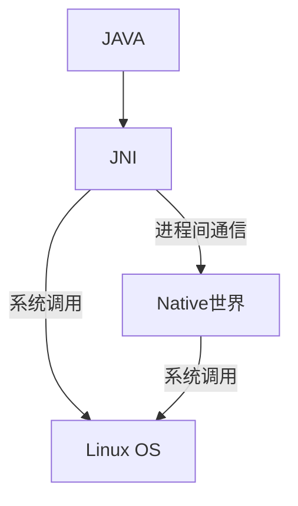

# 深入理解Android

## 资料推荐
- [Android官方文档](https://developer.android.com/guide/platform?hl=zh-cn)

## 卷 一

### 0. 章节内容概括
1. 准备: `Android` 系统架构和源码的阅读方法
2. `Android` 的 `MediaScanner` 进行分析，讲解`JNI`技术
3. `init`进程分析，解析`init.rc`来启动`Zygote`以及属性服务的工作原理
4. 重要: 
   1. `Zygote`, `SystemServer`等进程等工作机制
   2. 启动速度、虚拟机`HeapSize`的大小调整
   3. `Watchdog`工作原理
5. 讲解:    
   1. 讨论`Android`系统中常用的类，包括`sp, wp, RefBase, Thread`等类，同步类
   2. `Java`的`Handler`类和`Looper`类
6. `MediaServer`为切入点，对`Binder`分析
7. `Audio`系统深入分析，尤其是`AudioTrack, AudioFlinger, AudioPolicyService`工作原理
8. 讲解: 
   1. `Surface`系统的实现原理，分析 `Surface` 与 `Activity` 之间, 以及 `SurfaceFlinger`之间的关系
   2. `SurfaceFlinger`的工作原理
   3. `Surface`系统中的帧数据传输
   4. `LayerBuffer`的工作流程
9. `Vold, Rild`的原理和机制分析，讨论`Phone`设计优化
10. 多媒体系统的`MediaScanner`的原理


### 1. 准备
#### 1. 系统架构
Android基于Linux内核


大致分为4层:
1. `Linux`内核层: 内核和一些驱动模块
2. `Libraries`: 提供动态库(共享库)、`Android`运行时库、`Dalvik`虚拟机等, `Native` 层
3. `Framework`: Java基石
4. `Application`: 用户直接交互

交互:



#### 2. 环境搭建
1. 下载源码

```shell
apt-get install git-core curl # 下载工具
mkdir -p ~/develop/download-froyo
cd ~/develop/download-froyo
curl http://Android.git.kernel.org/repo > ./repo
chmod a+x repo
./repo init -u git://Android.git.kernel.org/platform/manifest.git -b froyo #初始化git库
./repo sync #下载源码
```

