# 【Web3】Remix(Ethereum IDE) 插件之 solidity-uml-gen，

> 前阵子在啃`Remix`的源代码，在给`official-remix`贡献代码。给自己留下一些记录，方便今后回来查找和阅读，也是另一种整理。

官方简介:
Remix Ethereum IDE 是一个基于 Web 的集成开发环境（IDE），专门用于智能合约的开发、调试和部署。它是以太坊区块链上智能合约的一个流行开发工具，由以太坊社区开发和维护。Remix 提供了一个用户友好的界面，允许开发者在浏览器中编写、测试和优化智能合约代码。

使用 Remix，开发者可以通过简单的图形化界面编写 Solidity 智能合约代码，并且可以在 IDE 中进行实时编辑和调试。它还提供了丰富的工具和功能，如代码自动补全、代码静态分析、合约部署、交易模拟等，帮助开发者更高效地进行以太坊智能合约的开发和调试。

Remix 是一个非常有用的工具，尤其对于初学者和中级开发者来说，它简化了智能合约开发的复杂性，并提供了一个便捷的方式来学习和探索以太坊区块链技术。同时，它也受到了以太坊开发社区的广泛支持和认可。

尽管`Remix`因为历史遗留问题，导致整体的结构和一些地方写得不够好，但瑕不掩瑜。现在只要是写`Solidity`，基本都会用到这个: [official-remix](https://remix.ethereum.org/)

Remix 预览：
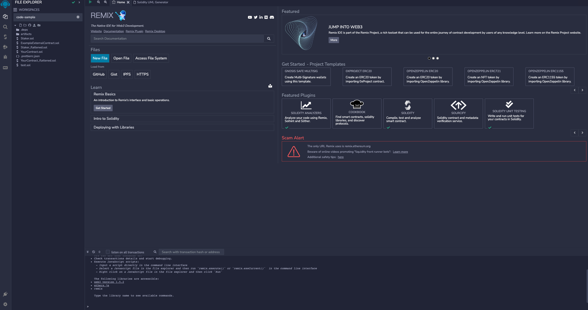

Remix UML 预览:
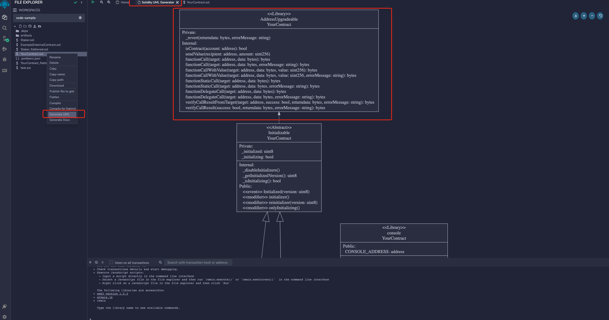

注意:

- 本文只涉及插件`solidity-uml-gen`, 其他插件不在本文讨论范围内。在了解该插件后，可以自定义增加新的插件
- 不涉及下层但 sol2UML 的逻辑，只涉及插件的使用。实际上 sol2UML 写得并不好，整体流程无非就是: `cst, ast, IR, render`
- 不涉及 Monaco 或者其他 IDE 逻辑。因为`Remix`使用了大量的 Event、 Reducer, 要一一来讲，篇幅太长，也不是本文的重点。尤其是 NX 的 dev，其实我是非常不满的。

梗概:

1. Remix
   - 插件的结构
   - 目录结构
2. 插件的使用
   - 注册
   - 调用
3. 插件的实现
   - 代码
   - 流程

## Remix

目录结构:

```bash
.
├── CONTRIBUTING.md
├── Dockerfile
├── Dockerfile.dev
├── LICENSE
├── README.md
├── apps
├── automation.md
├── babel.config.js
├── build-changelog.js
├── build-qa-doc.js
├── build.yaml
├── crowdin.yml
├── dist
├── docker-compose.yaml
├── gulpfile.js
├── lerna.json
├── libs
├── lint-fix-targets.js
├── node_modules
├── nodemon.json
├── nx.json
├── package.json
├── release-management.md
├── release-process.md
├── team-best-practices.md
├── tmp
├── tsconfig.base.json
├── tsconfig.json
├── tsconfig.paths.json
├── yarn-error.log
└── yarn.lock

5 directories, 26 files
```

Remix 是一个`Monorepo`，使用`Nx`管理。旧版本和新版本差别很大，不再赘述，有需要单独开一篇`NX`的文章。

- `apps`: 项目的主要代码, 显示、插件调用、代码格式化等都在此。我们可以把它看作是`Remix`的`render`层，也就是“前端”代码
- `libs`: 项目的核心代码，包括`Remix`的核心逻辑、插件的核心逻辑等。我们可以把它看作是`Remix`的`core`层，也就是“后端”代码
- 其他不重要，暂且放过

libs 的目录结构:

```bash
.
├── README.md
├── ghaction-helper
├── remix-analyzer
├── remix-astwalker
├── remix-core-plugin
├── remix-debug
├── remix-lib
├── remix-simulator
├── remix-solidity
├── remix-tests
├── remix-ui
├── remix-url-resolver
├── remix-ws-templates
└── remixd

13 directories, 1 file
```

`UML`属于`UI`，因此我们只需要关注`remix-ui`即可。

插件`solidity-uml-gen`目录:

```bash
.
└── src
    ├── index.ts
    ├── lib
    │   ├── components
    │   │   └── UmlDownload.tsx
    │   ├── css
    │   │   └── solidity-uml-gen.css
    │   ├── solidity-uml-gen.tsx
    │   └── utilities
    │       └── UmlDownloadStrategy.ts
    └── types
        └── index.ts

6 directories, 6 files
```

- `index.ts`: 插件的入口文件，主要是对外导出`lib`的内容
- `types`: 插件的类型定义，也就是我们常说的类型声明，或者`d.ts`也可
- `lib`: 插件的核心逻辑，包括`CSS`、`components`等
  - `solidity-uml-gen.tsx`: 这是我们常见的`React`组件，也就是`Plugin`的整体骨骼
  - `UmlDownload.tsx`: 对下载、图像放缩的方法封装
  - `UmlDownloadStrategy.ts`: 展示`UML`的策略，主要是 Blob 中的`URL`存放图像内容，然后绘制在 canvas 中

注意:

如果我们要添加插件，则必须继承`ViewPlugin`, 此为`Remix`对外暴露的插件接口。此处为
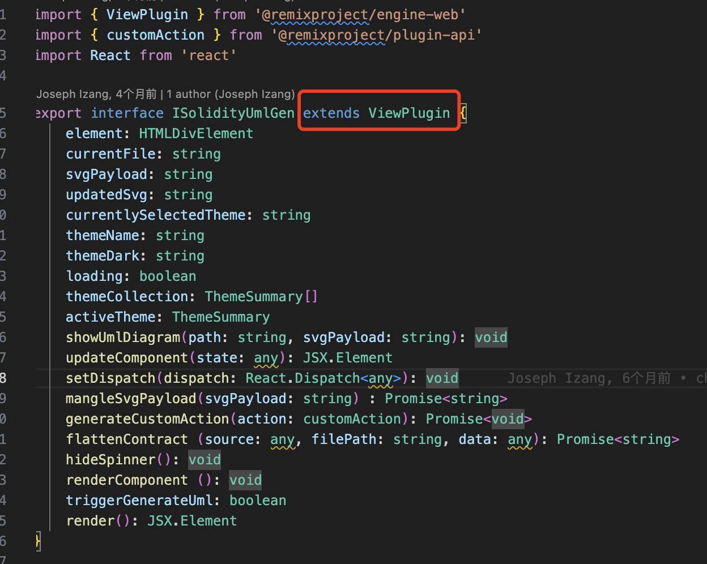

## 插件的使用

上面已经完成了插件的新增，下一步，我们如何让这个插件在`Remix`中生效呢？

答案是: 注册插件，并且调用

我们先关注注册。

在`apps/remix-ide/src/app/plugins`目录下，则是所有注册的插件。我们新增文件`solidity-umlgen.tsx`完成注册，并且要注意，此时注册要继承`ViewPlugin`。
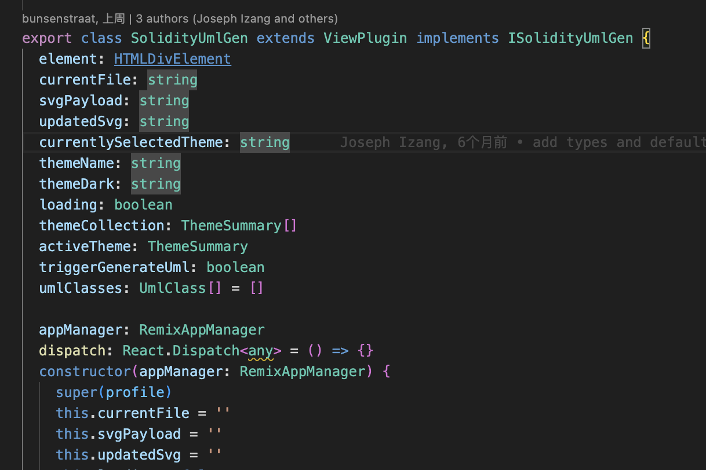

注册的内容是以上代码，但是我们需要注意，在`Remix`中，我们还有插件的命名等其他设置:
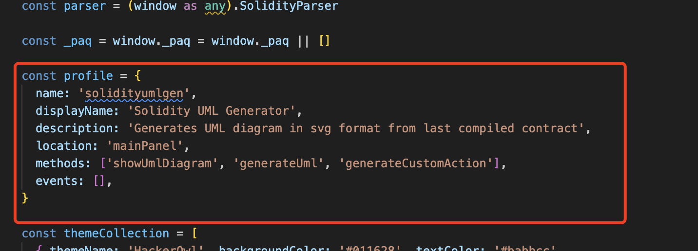

- `profile`: 插件的配置文件，包括`name`、`displayName`、`description`等，为必须存在
- `name`: 插件的名称
- `methods`: 对外暴露的方法，只有在这里注册时，IDE 才能够调用此插件使用

注意:
在 official remix 中，我们点击`Generate UML`时，会自动切换`tab`，其方法则是`onActivation`

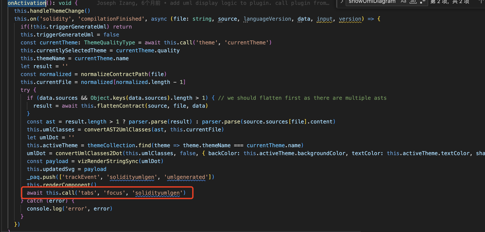

注册流程尚未结束。

我们在此进行注册，只是说明存在这个东西，在传统的 SE 开发中，我们还有下一步，则是引入此插件到核心，类比则是 webpack 的 load。

打开`apps/remix-ide/src/app.js`, 我们可以看到所有的注册插件都在此引入:

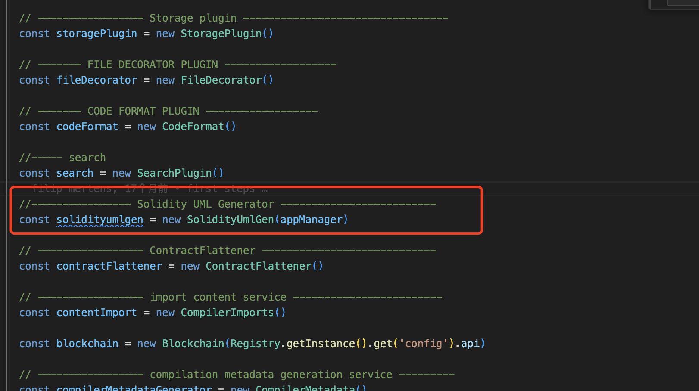

到这一步，我们则完成了插件的注册。

接下来，我们需要调用插件，也就是在`Remix`中使用插件。

打开`apps/remix-ide/src/remixAppManager.js`, 首先，我们要在 requiredModules 初始化该插件:
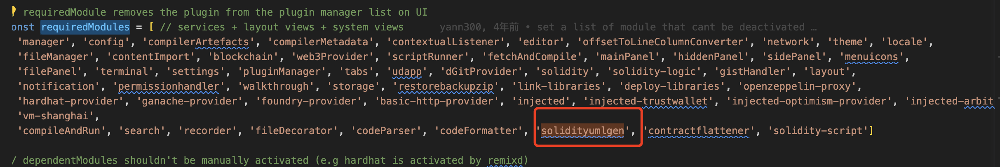

此处设计则为工厂模式，开始调用该插件:
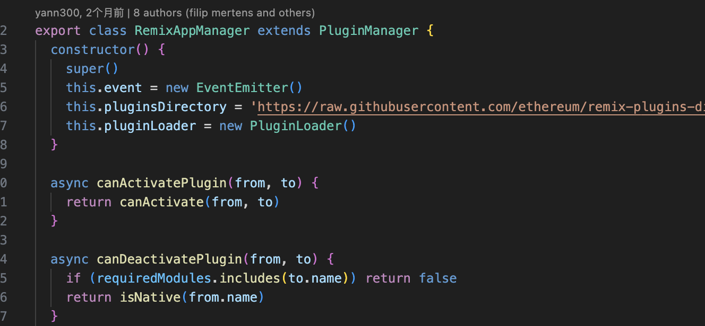

假设我们要把这个插件的调用放在右键点击文件的 Menu 中：
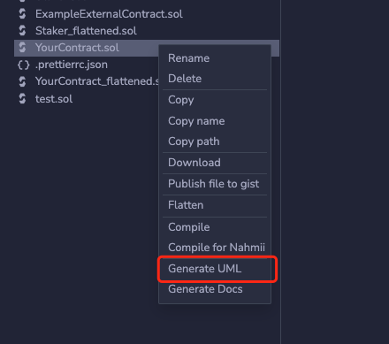

找到`registerContextMenuItems`方法，在其中写入以下代码:

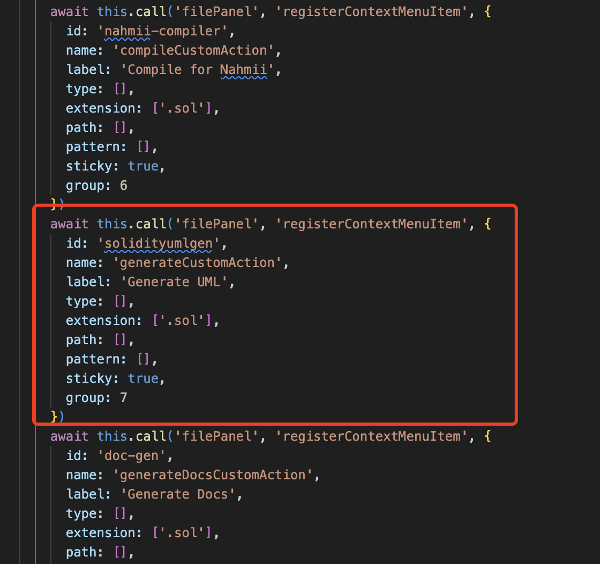

此时，我们已经完成了插件的调用。

- `label`: 右键菜单的名称
- `extension`: 右键菜单的触发条件，此处为文件后缀名

至于什么是`filePanel`, 为什么是这么设计。太过复杂，我们很难通过这里来解释，因此，我们只需要知道，我们可以在`Remix`中调用插件即可。

通过这些浏览，则可明白如何在`Remix`中增加、使用插件。爱好手搓轮子的同学，可以自行尝试。
