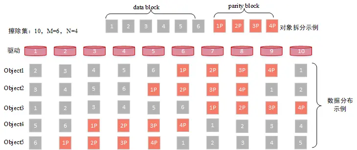
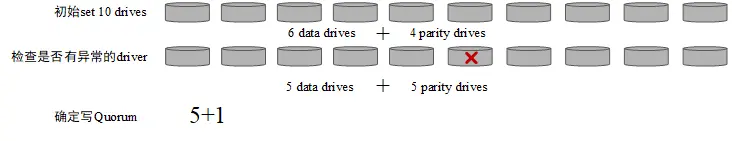
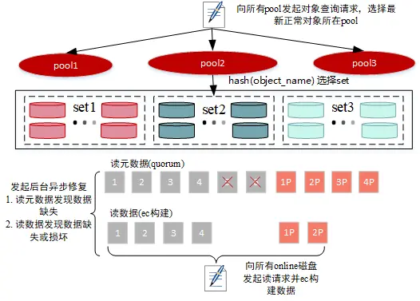
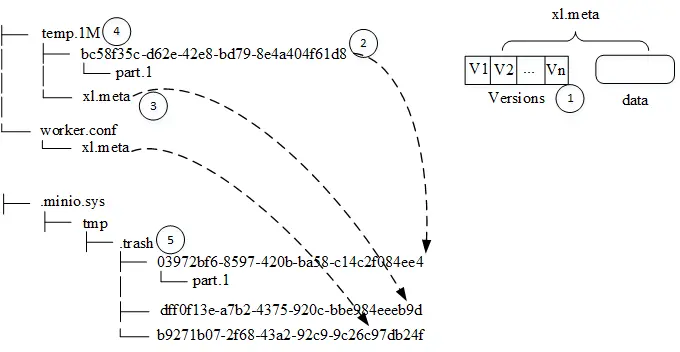

# 【RePost】A Brief Exploration of MinIO Source Code

## 1. Introduction

MinIO offers high-performance, S3-compatible object storage, designed for storing unstructured data such as videos, images, log files, backup data, and more. In this article, we will primarily focus on key processes within MinIO.

## 2. Glossary

Erasure Set: An erasure set refers to a group of erasure code sets, with a maximum of 32 drives. Erasure codes, as a data redundancy technique, provide sufficient data reliability with lower data redundancy compared to multiple copies. An erasure set includes data blocks and parity blocks, distributed randomly and evenly across different nodes.



> As shown in the above diagram, assuming an erasure set contains 10 drives (disks), it will form a 6+4 erasure code set. If a user uploads an object with a size of 6MB, it will be split into 6 individual 1MB data blocks. Then, based on erasure coding calculations, 4 additional 1MB parity blocks are generated. This totals 10MB of data, distributed randomly across the disks.

- Server Pool: A server pool consists of a group of MinIO nodes, and all nodes in the pool are started with the same command. As shown in the diagram, a pool may consist of 3 nodes and 6 drives, totaling 18 drives, forming a 9+9 erasure code set. A cluster may contain multiple erasure sets.


- Cluster: A cluster is composed of multiple server pools. As shown in the diagram, this cluster includes two pools.

## 3. Core Processes

The article primarily covers core processes such as uploading, downloading, deleting, and inspection.

### 3.1 Data Upload


Data Upload primarily involves the following processes (as shown in the diagram):

- Selecting a Server Pool
- Selecting an Erasure Set
- Erasure Code Calculation
- Data Writing

### 3.1.1 Selecting a Pool

> The source code for this is located in the `PutObject` method in `cmd/erasure-server-pool.go`.

- If there is only one pool, it is selected directly.
- If there are multiple pools, this is done in two steps:
  1. In the first step, it checks if the data (bucket+object) already exists. If it does, it returns the corresponding pool. If not, it proceeds to the next step.
  2. In the second step, it calculates which set unit each object should belong to based on object hashing. Then, it selects a pool based on the available capacity of each pool's corresponding set unit, with a high probability of choosing the pool with the most available capacity.

### 3.1.2 Selecting a Set

> The source code for this is located in the PutObject method in `cmd/erasure-sets.go`.

In fact, during pool selection, it already calculates which set the object will belong to. There are two hash algorithms here:

- `crcHash`: which calculates the CRC value of the object name % set size.
- `sipHash`: which calculates the hash of the object name and deploymentID % set size. This is the default algorithm in the current version.

### 3.1.3 Upload

> The source code for this is located in the PutObject method in `cmd/erasure-object.go`.

### 3.1.3.1 Determining the Number of Data Blocks, Parity Blocks, and Writing to Quorum



1. To determine the number of parity drives based on the user-configured `x-amz-storage-class` value:

   - For RRS (Reduced Redundancy Storage), if `MINIO_STORAGE_CLASS_RRS` is set during cluster initialization, it returns the corresponding number of parity drives, otherwise, it defaults to 2.
   - In other cases, if `MINIO_STORAGE_CLASS_STANDARD` is set, it returns the corresponding number of parity drives; otherwise, it returns the default values as follows table:

| Erasure Set Size | Default Parity (EC:N) |
| ---------------- | --------------------- |
| 5 or fewer       | EC:2                  |
| 6-7              | EC:3                  |
| 8 or more        | EC:4                  |

2. parityDrives is then increased by counting the number of offline or missing disks in the set. If parityDrives exceeds half of the set's disk count, the number of parity drives is set to half of the set's disk count. In other words, the number of parity drives is not fixed.

3. dataDrives is calculated as the number of drives in the set minus parityDrives.

4. writeQuorum is set to dataDrives, and if the number of data blocks is equal to the number of parity blocks, writeQuorum is incremented by one.

### 3.1.3.2 Data Writing

1. Reordering Disks in the set, determined by performing a CRC32 hash on the object's key to establish distribution relationships.


1. Determining the buffer size for EC (Erasure Code) calculations based on the object's size, with a maximum size of 1MB, equivalent to one block size.

2. Building data blocks and parity blocks for EC, as mentioned earlier in the specified buffer size.


- BlockSize: Indicates the size of data blocks used in erasure code calculations. It can be understood that for user data of 1MB, data blocks and parity blocks are calculated according to erasure code rules.
- ShardSize: The actual shard size of erasure code blocks. For example, if blockSize is 1MB and there are 5 data blocks, a single shard's size is 209,716 bytes (blockSize/dataBlocks rounded up), referring to the actual size of each data block within the erasure code.
- ShardFileSize: The final size of the erasure code data shard. For instance, if blockSize is 1MB, there are 5 data blocks, and a user uploads a 5MB object, it will undergo erasure code calculations in five iterations, resulting in a single shard with an actual file size of `5 *shardSize`.

4. Data is written to the corresponding nodes, and the strategy differs based on the shardFileSize:

- For small files: If the shardFileSize meets specific conditions (e.g., when using multi-versioning and shardFileSize is less than 128K or when shardFileSize is less than 16K), the data will be stored in the metadata (details will be explained later).
- For large files: Data is divided into blocks. When each block reaches 1MB, erasure code calculations are performed, and the last block's size may be less than 1MB. The shardFileSize is calculated accordingly (see the appendix for shardFileSize calculation details).

- Data writing incorporates a data bit protection mechanism to detect issues like disk silence or bit decay, ensuring that the retrieved data is correct. There are two bit protection strategies:

  - Streaming-bitrot: In this mode, each block calculates a hash value and writes it to the corresponding data file.
  - Whole-bitrot: This mode calculates a hash value for a file in the driver, such as block1+block6 shown in the previous section's diagram, and writes it to the metadata. The second approach offers coarser protection granularity and is currently the default strategy.


- For files smaller than 128K, regular IO is used; for large files, directIO is applied. The write buffer size is determined based on the file size, with a buffer size of 4M for data over 64M and 2M for other large files. If the data is aligned with 4K, directIO is used; otherwise, regular IO is employed (data will be flushed using fdatasync in the CreteFile method of `cmd/xl-storage.go`).

### 3.1.3.3 Metadata Writing

Metadata primarily includes the following information (detailed definitions can be found in the Object Metadata Information appendix):

- Volume: Bucket name.
- Name: File name.
- VersionID: Version number.
- Erasure: EC information for the object, including EC algorithm, number of data blocks, number of parity blocks, block size, data distribution status, and verification values (for the whole-bitrot verification method).
- DataDir: Object storage directory UUID.
- Data: Used for storing small object data.
- Parts: Shard information, including shard number, ETag, size, and actual size information, sorted by shard number.
- Metadata: User-defined metadata. If it's a small file, an "x-minio-internal-inline-data: true" metadata entry will be added.
- Size: Storage size, which may be greater than or equal to the actual data size.
- ModTime: Data update time.

Example (metadata information can be obtained using the `getFileInfo` method in the source code `xl-storage.go`).

```json
{
    "volume":"lemon",
    "name":"temp.2M",
    "data_dir":"8366601f-8d64-40e8-90ac-121864c79a45",
    "mod_time":"2021-08-12T01:46:45.320343158Z",
    "size":2097152,
    "metadata":{
        "content-type":"application/octet-stream",
        "etag":"b2d1236c286a3c0704224fe4105eca49"
    },
    "parts":[
        {
            "number":1,
            "size":2097152,
            "actualSize":2097152
        }
    ],
    "erasure":{
        "algorithm":"reedsolomon",
        "data":2,
        "parity":2,
        "blockSize":1048576,
        "index":4,
        "distribution":[
            4,
            1,
            2,
            3
        ],
        "checksum":[
            {
                "PartNumber":1,
                "Algorithm":3,
                "Hash":""
            }
        ]
    },
    ...
}
```

### 3.1.4 Organizational Structure of Data on Machines

We examine the file structure under a specific bucket (directory).

```bash
.
├── GitKrakenSetup.exe #文件名
│   ├── 449e2259-fb0d-48db-97ed-0d71416c33a3 #datadir，存放数据，分片上传的话会有多个part
│   │   ├── part.1
│   │   ├── part.2
│   │   ├── part.3
│   │   ├── part.4
│   │   ├── part.5
│   │   ├── part.6
│   │   ├── part.7
│   │   └── part.8
│   └── xl.meta #存放对象的元数据信息
├── java_error_in_GOLAND_28748.log #可以看到这个文件没有datadir，因为其为小文件将数据存放到了xl.meta中
│   └── xl.meta
├── temp.1M
│   ├── bc58f35c-d62e-42e8-bd79-8e4a404f61d8
│   │   └── part.1
│   └── xl.meta
├── tmp.8M
│   ├── 1eca8474-2739-4316-9307-12fac3a3ccd9
│   │   └── part.1
│   └── xl.meta
└── worker.conf
    └── xl.meta

```

### 3.1.5 Reflections

> a. How is data that fails to meet the quorum during writing cleaned up?

MinIO which first writes data from various nodes to a temporary directory during data writing. If the write does not meet the quorum, the data in the temporary directory would be deleted.

> b. How is data recovered from nodes that fail to meet the quorum during successful writes?

Data written with quorum compliance and a certain level of data reliability can significantly improve data reliability if failed writes can be recovered by some means. So, regarding the above question, we can think about it from two aspects:

1. Detecting failed writes;
2. How to recover. Recovering data is relatively straightforward, as it can be achieved through erasure code calculations. Therefore, here we mainly focus on how to detect missing data.

- Detection during data writing: When writing data, we can determine which nodes have failed to write data. Initiating data repair at this point can quickly recover the failed data. However, this may introduce some complexity in the design.

- Detection during data reading: When a normal read request comes in, we can identify which nodes have missing data. However, relying solely on read requests to detect missing data may have some latency, especially in scenarios with more writes than reads.

- Detection during data inspection: Data inspection can provide a more comprehensive way to detect missing data but may consume more system resources. MinIO combines methods 2 and 3 to detect missing data and perform repairs.

> c. Data writing waits for responses from all nodes (whether successful or failed). Is there room for optimization here?

In practice, waiting for responses from all nodes during data writing can lead to a long tail effect, causing unstable write latency. If writes are considered successful when they meet the quorum and responses from other nodes are awaited in the background, it can improve write speed to some extent. However, this approach also introduces complexity in the design.

### 3.2 Data Download



### 3.2.1 Selecting a Pool

> Source code in `cmd/erasure-server-pool.go` in the GetObjectNInfo method:

- For a single pool, directly request the corresponding pool.
- For multiple pools:

  - Send object query requests to all pools.
  - Sort the results in descending order based on file modification time, with lower pool indexes taking precedence.
  - Traverse the results to obtain information about the pool where the normal object resides (assuming there were no failures in obtaining object information from the corresponding pool).

### 3.2.2 Selecting a Set

> Source code in `cmd/erasure-sets.go` in the GetObjectNInfo method:

- Similar to uploading objects, hash the object name to determine the specific set for storage.

### 3.2.3 Reading Metadata

> Source code in `cmd/erasure-object.go` in the GetObjectNInfo method:

- Send metadata read requests to all nodes.
- If more than half of the nodes fail, return a read failure.
- Determine the readQuorum (data block size, i.e., the number of data blocks) based on metadata information.
- Check if the metadata satisfies the quorum mechanism based on the error information returned in the first step.
- If it doesn't satisfy the quorum, check if it's garbage data and perform data deletion if necessary.
- If it satisfies the quorum, validate the metadata information obtained in the first step for correctness.
- If it meets the quorum mechanism, the metadata reading is successful.
- If the information returned in the first step indicates disk failures, the data repair process will not be initiated, and metadata information will be returned directly.
- Check if the object has missing blocks, and if so, initiate asynchronous repairs in the background (file missing repairs).

### 3.2.4 Reading Data

- Sort disks based on data distribution.
- Read data and perform EC reconstruction.
- If the expected data size is reached but missing or corrupt data is discovered during the reading process, initiate asynchronous repairs in the background, which does not affect normal data reading.

  - File Missing: Repair type is HealNormalScan.
  - Data Corruption: Repair type is HealDeepScan.

### 3.2.5 Considerations

> a. Data reading sends read requests to all online nodes every time. Is it possible to send requests to only a subset of nodes? What should be considered?

Typically, as long as you can read the number of data blocks, you can reconstruct all the data. Sending read requests to all nodes can improve data read speed. However, the consideration for sending read requests to all nodes may be related to discovering missing data through data reading and repairing it promptly. Relying solely on inspections may introduce some latency.

> b. The trigger process for data repair relies on the limitations of read requests. For some cold data, it may never get repaired. Are there other processes to repair data?

In addition to discovering missing data based on read requests, there is also a background inspection process that can repair missing data.

### 3.3 Data Deletion

Deletion is relatively straightforward, and here we primarily introduce the DeleteObject method.

### 3.3.1 Normal Deletion

Source code in cmd/erasure-server-pool.go in the DeleteObject method:

- Prefix deletion: Sends deletion requests to all pools.
- Non-prefix deletion:
  - Select a pool and send a deletion request to the corresponding pool.
    - For a single pool, return directly.
    - Send query requests to all pools, sort the results by update time in descending order, and return the pool obtained by traversing the results. If the newest object exists but is marked as deleted, it will also return the pool.
    - If the object does not exist, return directly.
    - For other errors, return directly.
  - Select a set and send a deletion request to the corresponding set.
  - Deletion: Determine writeQuorum, which is the size of the set's disks divided by 2 plus 1, and send deletion requests to all nodes.
  - Delete the corresponding version in the metadata.
  - If a data directory exists (small file data is stored in xl.meta files, while large files have data directories), move the data to the temporary bucket minioMetaTmpDeletedBucket for asynchronous cleanup.
  - Move the metadata file to the temporary bucket minioMetaTmpDeletedBucket for asynchronous cleanup.
  - Delete the object directory.



As shown in the diagram, the file "temp.1M" is a large file, and the data storage structure on the disk is as shown on the left. When deleting, the following key steps are taken:

1. Delete the corresponding version in the metadata file "xl.meta." For single-version deletion, the "Versions" slice element is removed, resulting in an empty slice.
2. Move the data directory and its data files to the recycle bin.
3. Move the metadata file to the recycle bin.
4. Delete the object directory.
5. Asynchronously clear the recycle bin contents.

### 3.3.2 Considerations:

> a. If data deletion does not meet the quorum mechanism, will the deleted data be repaired?

There are several scenarios to consider when data deletion fails. Deletion failures can result from either metadata deletion or data deletion. Here are a few scenarios:

- If metadata deletion partially fails, leading to a failure to meet the quorum, and if other remaining metadata can still be read successfully, the data may be repaired during the inspection process. However, this does not impact the user, as the deletion is reported as a failure, and the data can be deleted in a subsequent attempt.

- If all metadata deletions are successful but data deletions are not, resulting in a failure to meet the quorum, inspection will not repair the data.

> b. Deleted data is temporarily stored in the recycle bin. Is there a way to recover data from the recycle bin?

Currently, there is no code for data recovery from the recycle bin. However, as long as the data exists, it can potentially be recovered through certain methods.

> c. Deletion meets the quorum mechanism. How are failed deletion nodes handled?

Data on failed deletion nodes is essentially considered garbage data. The data inspection process will be responsible for deleting data on these nodes. During the inspection process, if data that does not meet the quorum is found, data cleaning operations will be executed.

### 3.4 Disk Repair

#### 3.4.1 Discovering Faulty Disks

The source code is found in the "connectDisks" method in "cmd/erasure-sets.go."

Regularly inspect each disk to check if it includes the disk formatting file "format.json."

```json
{
  "version": "1",
  "format": "xl",
  "id": "8acad898-054b-4414-92b1-b01a49d61407",
  "xl": {
    "version": "3",
    "this": "8585ed86-180f-4fd4-a95e-83d5ef2943ec",
    "sets": [
      [
        "8585ed86-180f-4fd4-a95e-83d5ef2943ec",
        "dba71e26-9bb0-49a4-9c4a-d4c1fb8dca6d",
        "49fb2e14-3c71-4d59-99dd-f26029928f4a",
        "5f755d25-bce7-40e7-b1cc-a360c7b8e4c7"
      ]
    ],
    "distributionAlgo": "SIPMOD+PARITY"
  }
}
```

If it is not included, it will check whether the current disk still contains user data. If it does, it will report it as an unexpected disk. If there is no other data, it indicates a newly formatted disk and returns a specific error, "errUnformattedDisk."

For local disks that encounter the "errUnformattedDisk" error, they are added to the queue of disks awaiting repair.

### 3.4.2 Disk Repair

The source code is in the "monitorLocalDisksAndHeal" method in "cmd/background-newdisks-heal-ops.go."

Periodically check if there are disks awaiting repair. If they exist, the following operations will be performed:

- HealFormat: Check if the "format.json" file is missing from all disks in the cluster. If missing, it will be repaired.
- HealBucket: Repair bucket metadata.
- HealObject: Repair files within the bucket.

Below is an example log for disk repair.

```bash
Found drives to heal 1, proceeding to heal content...
Healing disk '/data/minio/data1' on 1st pool
Healing disk '/data/minio/data1' on 1st pool complete
Summary:
{
  "ID": "8585ed86-180f-4fd4-a95e-83d5ef2943ec",
  "PoolIndex": 0,
  "SetIndex": 0,
  "DiskIndex": 0,
  "Path": "/data/minio/data1",
  "Endpoint": "/data/minio/data1",
  "Started": "2021-10-15T10:07:27.12996706+08:00",
  "LastUpdate": "2021-10-15T02:07:40.784965249Z",
  "ObjectsTotalCount": 11,
  "ObjectsTotalSize": 561956829,
  "ItemsHealed": 20,
  "ItemsFailed": 0,
  "BytesDone": 561966273,
  "BytesFailed": 0,
  "QueuedBuckets": [],
  "HealedBuckets": [
    ".minio.sys/config",
    ".minio.sys/buckets",
    "lemon"
  ]
}
```

### 3.5 Data Inspection

> The source code is in the "runDataScanner" method in "cmd/data-scanner.go."

Data inspection mainly involves the following tasks:

- Identifying missing data and attempting to repair it. Data that cannot be repaired (garbage data) is cleaned up.
- Collecting metric information such as the number of files, storage capacity, and the number of buckets.

During inspections, the data scanner examines all data in every bucket on each disk. Here's how it discovers data that needs repair and executes repairs:

1. When scanning object information: If missing or corrupted data is found, it will be rapidly or deeply repaired. A deep scan checks the integrity of data files, while a fast scan checks for missing data. Not every inspection triggers a repair; typically, it occurs after a certain number of inspections. Repairs are executed immediately.

2. Comparing with the results of the previous inspection: For example, if file A was found missing in the last inspection but not in the current one and certain conditions are met, a repair operation is initiated. The inspection initially submits a repair message, and the repair is done asynchronously.

> Each inspection caches its results locally and compares them with the next inspection.

### 3.6 Garbage Data Cleanup

As mentioned earlier, after data is deleted, it is moved to the recycle bin and periodically scanned and cleaned up by a background coroutine. Here's how the cleaning process works:

> The source code is in "erasure-sets.go" under "cleanupDeletedObjects."

The cleanup strategy is quite simple; it periodically clears all files from the recycle bin. This means that there is no separate time protection window for data placed in the recycle bin; it is cleared regularly.

## 4. Appendix

### 4.1 Calculation of EC Data Distribution Patterns

```go
// hashOrder - hashes input key to return consistent
// hashed integer slice. Returned integer order is salted
// with an input key. This results in consistent order.
// NOTE: collisions are fine, we are not looking for uniqueness
// in the slices returned.
func hashOrder(key string, cardinality int) []int {
	if cardinality <= 0 {
		// Returns an empty int slice for cardinality < 0.
		return nil
	}

	nums := make([]int, cardinality)
	keyCrc := crc32.Checksum([]byte(key), crc32.IEEETable)

	start := int(keyCrc % uint32(cardinality))
	for i := 1; i <= cardinality; i++ {
		nums[i-1] = 1 + ((start + i) % cardinality)
	}
	return nums
}

```

### 4.2 Calculation of shardFileSize

```go
// ceilFrac takes a numerator and denominator representing a fraction
// and returns its ceiling. If denominator is 0, it returns 0 instead
// of crashing.
func ceilFrac(numerator, denominator int64) (ceil int64) {
	if denominator == 0 {
		// do nothing on invalid input
		return
	}
	// Make denominator positive
	if denominator < 0 {
		numerator = -numerator
		denominator = -denominator
	}
	ceil = numerator / denominator
	if numerator > 0 && numerator%denominator != 0 {
		ceil++
	}
	return
}

// ShardSize - returns actual shared size from erasure blockSize.
func (e *Erasure) ShardSize() int64 {
	return ceilFrac(e.blockSize, int64(e.dataBlocks))
}

// ShardFileSize - returns final erasure size from original size.
func (e *Erasure) ShardFileSize(totalLength int64) int64 {
	if totalLength == 0 {
		return 0
	}
	if totalLength == -1 {
		return -1
	}
	numShards := totalLength / e.blockSize
	lastBlockSize := totalLength % e.blockSize
	lastShardSize := ceilFrac(lastBlockSize, int64(e.dataBlocks))
	return numShards*e.ShardSize() + lastShardSize
}

```

### 4.3 Metadata Information for Objects

```go
type FileInfo struct {
	// Name of the volume.
	Volume string

	// Name of the file.
	Name string

	// Version of the file.
	VersionID string

	// Indicates if the version is the latest
	IsLatest bool

	// Deleted is set when this FileInfo represents
	// a deleted marker for a versioned bucket.
	Deleted bool

	// TransitionStatus is set to Pending/Complete for transitioned
	// entries based on state of transition
	TransitionStatus string
	// TransitionedObjName is the object name on the remote tier corresponding
	// to object (version) on the source tier.
	TransitionedObjName string
	// TransitionTier is the storage class label assigned to remote tier.
	TransitionTier string
	// TransitionVersionID stores a version ID of the object associate
	// with the remote tier.
	TransitionVersionID string
	// ExpireRestored indicates that the restored object is to be expired.
	ExpireRestored bool

	// DataDir of the file
	DataDir string

	// Indicates if this object is still in V1 format.
	XLV1 bool

	// Date and time when the file was last modified, if Deleted
	// is 'true' this value represents when while was deleted.
	ModTime time.Time

	// Total file size.
	Size int64

	// File mode bits.
	Mode uint32

	// File metadata
	Metadata map[string]string

	// All the parts per object.
	Parts []ObjectPartInfo

	// Erasure info for all objects.
	Erasure ErasureInfo

	// DeleteMarkerReplicationStatus is set when this FileInfo represents
	// replication on a DeleteMarker
	MarkDeleted                   bool // mark this version as deleted
	DeleteMarkerReplicationStatus string
	VersionPurgeStatus            VersionPurgeStatusType

	Data []byte // optionally carries object data

	NumVersions      int
	SuccessorModTime time.Time
}

```

Example 20 disks and 2 sets:

```json
{
  "version": "1",
  "format": "xl",
  "id": "921e205e-15bc-480e-899d-8f220a0d908a",
  "xl": {
    "version": "3",
    "this": "d3b71e3d-f71c-4140-a982-81071be76687",
    "sets": [
      [
        "d3b71e3d-f71c-4140-a982-81071be76687",
        "6e80d70a-7ce3-4446-a078-4ea97272deb4",
        "fdfe30e1-97ba-48ad-8db9-b36f1adb40df",
        "68e99791-8f3e-4b68-8e61-57b39ce8e105",
        "8211a0d6-2be4-47a9-a08c-5bd42821fd47",
        "b2bb82a4-cf92-406a-9a4b-235b4608009b",
        "6bd02b7d-e40f-4d6d-ae28-cae9555a8148",
        "da7fe426-232d-4510-bb28-1b4c6fff1695",
        "1aa3fca1-20e5-48ac-8ac2-b49399300a42",
        "b9088ba0-bf4c-45a7-87f7-3d10266577ab"
      ],
      [
        "500a6ae7-a46e-4ad9-a409-d6265d0d7d54",
        "01b55e5f-3e15-4a0c-8a18-1ee9e1864753",
        "7ce04256-c860-411f-92ea-bd5c5335d358",
        "f334e1bd-498e-4d44-9ff7-2f7c41c40c7b",
        "81c39b83-7215-49e1-86c5-e1af3d0283a4",
        "e9d832fa-73e4-4963-90c3-8d11048a3dfc",
        "e5c291ce-cc14-484a-b707-61088f91fd8c",
        "6af2ed10-67ef-4c9f-b3fb-4a0bce6732b5",
        "63fa146c-71bd-4466-a130-23c8d2b50cab",
        "b80ca0e5-3e04-4b90-a1b6-6e83669c046d"
      ]
    ],
    "distributionAlgo": "SIPMOD+PARITY"
  }
}
```
