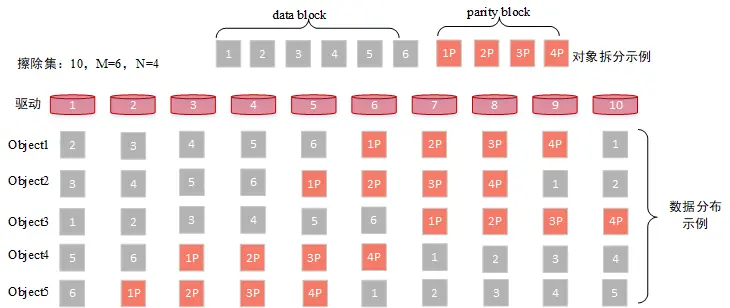
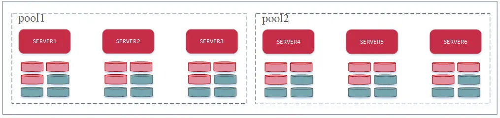
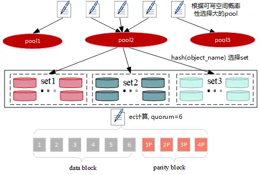
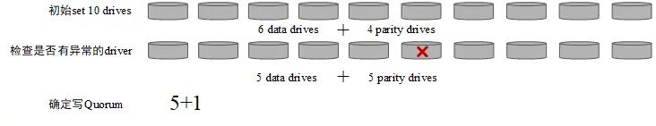
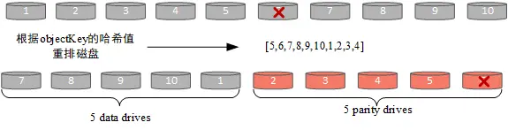
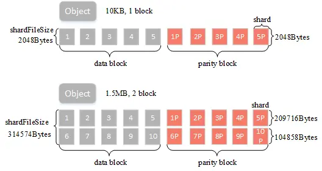
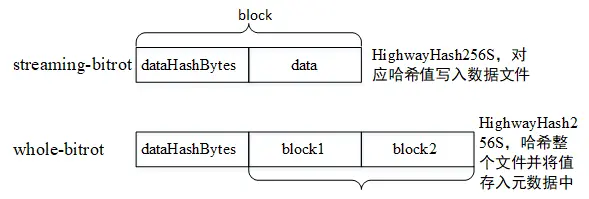
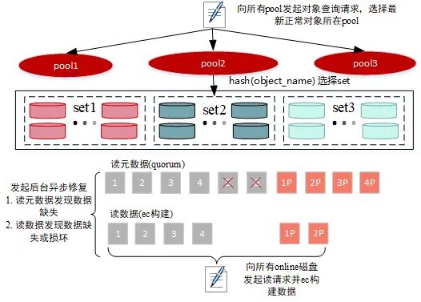
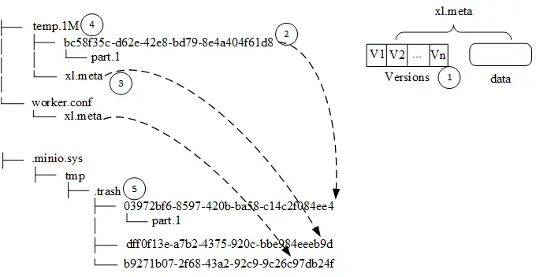

# 【転載】MinIO ソースコードの簡単な探求

## 1. はじめに

MinIO は、高性能で S3 互換のオブジェクトストレージを提供し、ビデオ、画像、ログファイル、バックアップデータなどの非構造化データを保存するために設計されています。この記事では、MinIO 内の主要なプロセスに焦点を当てます。

## 2. 用語解説

イレイシャセット（Erasure Set）：イレイシャセットは、最大 32 のドライブからなるイレイションコードセットのグループを指します。イレイションコードは、複数のコピーと比較して低いデータ冗長性で十分なデータ信頼性を提供するデータ冗長性技術です。イレイシャセットにはデータブロックとパリティブロックが含まれ、異なるノードにランダムかつ均等に分布しています。



> 図に示すように、イレイシャセットには 10 のドライブ（ディスク）が含まれていると仮定します。それは 6+4 のイレイションコードセットを構成します。ユーザーが 6MB のサイズのオブジェクトをアップロードした場合、それは 6 つの個別の 1MB データブロックに分割されます。その後、イレイションコードの計算に基づいて、さらに 1MB のパリティブロック 4 つが生成されます。これは合計で 10MB のデータで、ディスク上にランダムに分散されています。

- サーバープール（Server Pool）：サーバープールは、MinIO ノードのグループで構成され、プール内のすべてのノードは同じコマンドで起動されます。図に示すように、プールは 3 つのノードと 6 つのドライブで構成され、計 18 つのドライブからなり、9+9 のイレイションコードセットを形成します。クラスターには複数のイレイションセットが含まれることがあります。



- クラスター（Cluster）：クラスターは複数のサーバープールで構成されています。図に示すように、このクラスターには 2 つのプールが含まれています。

## 3. コアプロセス

この記事では、主にアップロード、ダウンロード、削除、検査などのコアプロセスについて説明します。

### 3.1 データのアップロード



データのアップロードは、主に次のプロセスからなります（図に示されている通り）：

- サーバープールの選択
- イレイシャセットの選択
- イレイションコードの計算
- データの書き込み

### 3.1.1 プールの選択

> これに関するソースコードは、`cmd/erasure-server-pool.go` の `PutObject` メソッドにあります。

- プールが 1 つだけの場合、それが直接選択されます。
- 複数のプールがある場合、2 つのステップに分かれます：
  1. 最初のステップでは、データ（バケット+オブジェクト）が既に存在するかどうかをチェックします。存在する場合、対応するプールが返されます。存在しない場合、次のステップに進みます。
  2. 2 番目のステップでは、オブジェクトのハッシュに基づいてどのセットユニットにオブジェクトを配置するかを計算します。その後、各プールの対応するセットユニットの利用可能な容量に基づいてプールを選択し、利用可能な容量が最も多いプールが高い確率で選択されます。

### 3.1.2 セットの選択

> これに関するソースコードは、`cmd/erasure-sets.go` の `PutObject` メソッドにあります。

実際、プールの選択時には、すでにオブジェクトがどのセットに属するかを計算しています。ここには 2 つのハッシュアルゴリズムがあります：

- `crcHash` は、オブジェクト名の CRC 値 % セットのサイズを計算します。
- `sipHash` は、オブジェクト名と deploymentID のハッシュを計算して % セットのサイズを得ます。これが現在のバージョンのデフォルトアルゴリズムです。

### 3.1.3 アップロード

> これに関するソースコードは、`cmd/erasure-object.go` の `PutObject` メソッドにあります。

### 3.1.3.1 データブロック、パリティブロックの数の決定およびクォーラムへの書き込み



1. ユーザーが設定した x-amz-storage-class 値に基づいてパリティドライブの数を決定するには、次のようにします：

- RRS（Reduced Redundancy Storage）の場合、クラスターの初期化時に `MINIO_STORAGE_CLASS_RRS` が設定されている場合は、対応するパリティドライブの数を返し、それ以外の場合はデフォルトで 2 になります。
- その他の場合、`MINIO_STORAGE_CLASS_STANDARD` が設定されている場合は、対応するパリティドライブの数を返し、それ以外の場合は以下のデフォルト値を返します：

| イレイションセットのサイズ | デフォルトのパリティ（EC:N） |
| -------------------------- | ---------------------------- |
| 5 以下                     | EC:2                         |
| 6-7                        | EC:3                         |
| 8 以上                     | EC:4                         |

2. 次に、parityDrives はセット内のオフラインまたは存在しないディスクの数をカウントして増加します。parityDrives がセットのディスク数の半分を超える場合、パリティドライブの数はセットのディスク数の半分に設定されます。言い換えれば、パリティドライブの数は固定されていません。

3. dataDrives はセット内のドライブの数から parityDrives を引いて計算されます。

4. writeQuorum は dataDrives に設定され、データブロックの数がパリティブロックの数と等しい場合、writeQuorum は 1 増加します。

### 3.1.3.2 データの書き込み

1. セット内のディスクを再配置し、オブジェクトのキーに対して CRC32 ハッシュを実行して分布関係を確立します。



1. オブジェクトのサイズに基づいて EC（イレイションコード）計算のバッファサイズを決定します。最大サイズは 1MB で、1 つのブロックサイズに相当します。

2. 指定されたバッファサイズで EC のデータブロックとパリティブロックを構築します。



- ブロックサイズ：イレイションコード計算に使用されるデータブロックのサイズを示します。1MB のユーザーデータの場合、イレイションコードのルールに従ってデータブロックとパリティブロックが計算されます。
- シャードサイズ：イレイションコードブロックの実際のシャードサイズ。たとえば、ブロックサイズが 1MB でデータブロックが 5 つある場合、単一のシャードのサイズは 209,716 バイト（blockSize/dataBlocks を切り上げたもの）で、イレイションコード内の各データブロックの実際のサイズを指します。
- シャードファイルサイズ：イレイションコードデータの最終サイズ。たとえば、ブロックサイズが 1MB でデータブロックが 5 つあり、ユーザーが 5MB のオブジェクトをアップロードした場合、それは 5 回のイレイションを経て、1 つのシャードの実際のファイルサイズは `5*shardSize` になります。

4. データは対応するノードに書き込まれ、shardFileSize に基づいて異なるストラテジーが適用されます。

- 小さなファイルの場合：shardFileSize が特定の条件を満たす場合（マルチバージョンを使用し、shardFileSize が 128K 未満の場合、または shardFileSize が 16K 未満の場合など）、データはメタデータに保存されます（詳細は後述します）。

- 大きなファイルの場合：データはブロックに分割されます。各ブロックが 1MB に達すると、イレイションコード計算が実行され、最後のブロックのサイズは 1MB 未満になることがあります。それに応じて shardFileSize が計算されます（shardFileSize の計算の詳細は付録を参照）。

- データの書き込みにはデータビットの保護メカニズムが組み込まれており、ディスクの静黙またはビットの劣化などの問題を検出し、取得されるデータが正しいことを保証します。データビットの保護には 2 つのストラテジーがあります。

  - streaming-bitrot：このモードでは、各ブロックはハッシュ値を計算し、対応するデータファイルに書き込みます。
  - whole-bitrot：このモードでは、ドライバ内のファイルに対してハッシュ値を計算します。たとえば、前のセクションの図に示すように、block1+block6 に対してハッシュ値を計算し、それをメタデータに書き込みます。第 2 のアプローチは保護の粒度が粗いことがあり、現在はデフォルトのストラテジーです。



- 128K 未満のファイルは通常の IO を使用し、大きなファイルは directIO を使用します。書き込みバッファサイズはファイルサイズに基づいて決定され、64M 以上のデータの場合、バッファサイズは 4M になります。その他の大きなファイルは 2M です。データが 4K に整列している場合、directIO が使用され、それ以外の場合は通常の IO が使用されます（データは `cmd/xl-storage.go` の CreteFile メソッドで fdatasync を使用してフラッシュされます）。

### 3.1.3.3 メタデータの書き込み

メタデータには主に以下の情報が含まれます（詳細な定義は「オブジェクトメタデータ情報」の付録に記載されています）：

- Volume：バケット名。
- Name：ファイル名。
- VersionID：バージョン番号。
- Erasure：オブジェクトの EC 情報。EC アルゴリズム、データブロック数、パリティブロック数、ブロックサイズ、データ分布状態、および検証値（whole-bitrot 検証方法用）を含みます。
- DataDir：オブジェクトストレージディレクトリ UUID。
- Data：小さなオブジェクトデータを格納するために使用されます。
- Parts：シャード情報。シャード番号、ETag、サイズ、および実際のサイズ情報を含み、シャード番号でソートされています。
- Metadata：ユーザー定義のメタデータ。小さなファイルの場合、「x-minio-internal-inline-data: true」というメタデータエントリが追加されます。
- Size：ストレージサイズ。実際のデータサイズ以上か、それに等しい場合があります。
- ModTime：データの更新時間。

例（メタデータ情報はソースコード `xl-storage.go` の `getFileInfo` メソッドを使用して取得できます）。

```json
{
    "volume":"lemon",
    "name":"temp.2M",
    "data_dir":"8366601f-8d64-40e8-90ac-121864c79a45",
    "mod_time":"2021-08-12T01:46:45.320343158Z",
    "size":2097152,
    "metadata":{
        "content-type":"application/octet-stream",
        "etag":"b2d1236c286a3c0704224fe4105eca49"
    },
    "parts":[
        {
            "number":1,
            "size":2097152,
            "actualSize":2097152
        }
    ],
    "erasure":{
        "algorithm":"reedsolomon",
        "data":2,
        "parity":2,
        "blockSize":1048576,
        "index":4,
        "distribution":[
            4,
            1,
            2,
            3
        ],
        "checksum":[
            {
                "PartNumber":1,
                "Algorithm":3,
                "Hash":""
            }
        ]
    },
    ...
}
```

### 3.1.4 マシン上のデータの組織構造

特定のバケット（ディレクトリ）のファイル構造を調査します。

```bash
.
├── GitKrakenSetup.exe #文件名
│   ├── 449e2259-fb0d-48db-97ed-0d71416c33a3 #datadir，存放数据，分片上传的话会有多个part
│   │   ├── part.1
│   │   ├── part.2
│   │   ├── part.3
│   │   ├── part.4
│   │   ├── part.5
│   │   ├── part.6
│   │   ├── part.7
│   │   └── part.8
│   └── xl.meta #存放对象的元数据信息
├── java_error_in_GOLAND_28748.log #可以看到这个文件没有datadir，因为其为小文件将数据存放到了xl.meta中
│   └── xl.meta
├── temp.1M
│   ├── bc58f35c-d62e-42e8-bd79-8e4a404f61d8
│   │   └── part.1
│   └── xl.meta
├── tmp.8M
│   ├── 1eca8474-2739-4316-9307-12fac3a3ccd9
│   │   └── part.1
│   └── xl.meta
└── worker.conf
    └── xl.meta

```

### 3.1.5 考察

> a. 書き込み中にクォーラムを満たさないデータはどのようにクリーンアップされますか？

MinIO はデータの書き込み時に、まず各ノードからのデータを一時ディレクトリに書き込みます。書き込みがクォーラムを満たさない場合、一時ディレクトリ内のデータは削除されます。

> b. 書き込み中にクォーラムを満たさないノードからデータを復元する方法は何ですか？

クォーラムの条件を満たす成功した書き込み時に、失敗した書き込みを復元することができれば、データの信頼性が大幅に向上する可能性があります。したがって、上記の質問について、2 つの側面から考えることができます。

1. 失敗したデータの検出方法；
2. 復元方法。データの復元は比較的単純で、イレイションコード計算を介して実行できます。したがって、ここでは主に不足データを検出する方法に焦点を当てます。

- データの書き込み中の検出：データを書き込む際、どのノードがデータの書き込みに失敗したかを知ることができます。この時点でデータ修復を開始すると、失敗したデータを迅速に回復できますが、設計上一定の複雑さを導入する可能性があります。

- データ読み取り中の検出：通常の読み取りリクエストが発生した際、どのノードにデータが欠落しているかを特定できます。ただし、欠落データを検出するために読み取りリクエストだけに依存することは、特に書き込み回数が読み込み回数よりも多いシナリオでは一定の遅延が生じる可能性があります。

- データ点検中の検出：データ点検は欠落データをより包括的に検出できますが、システムリソースをより多く消費する可能性があります。MinIO は方法 2 と方法 3 を組み合わせて欠落データを検出し、修復を実行します。

> c. データ書き込みはすべてのノードからの応答を待機します（成功または失敗に関わらず）。ここで最適化の余地はありますか？

実際のデータ書き込みでは、すべてのノードからの応答を待機することは、長いテール効果を引き起こし、不安定な書き込み遅延をもたらす可能性があります。クォーラムを満たす場合は成功と見なし、他のノードからの応答をバックグラウンドで待機させると、書き込み速度がある程度向上する可能性があります。ただし、このアプローチは設計上複雑さを導入する一方で、書き込み速度向上に寄与します。

### 3.2 データのダウンロード



### 3.2.1 プールの選択

> `cmd/erasure-server-pool.go` の GetObjectNInfo メソッド内のソースコード：

- 単一のプールの場合、対応するプールに直接リクエストを送信します。
- 複数のプールの場合：

  - すべてのプールにオブジェクトクエリリクエストを送信します。
  - ファイルの変更時間を基準に結果を降順でソートし、プールのインデックスが小さいものが優先されます。
  - 結果をトラバースして通常のオブジェクトが存在するプールの情報を取得します（対応するプールからオブジェクト情報の取得でエラーが発生しない場合）。

### 3.2.2 セットの選択

`cmd/erasure-sets.go` の GetObjectNInfo メソッド内のソースコード：

- オブジェクト名をハッシュ化して、具体的なセットをストレージするために使用します。

### 3.2.3 メタデータの読み取り

> `cmd/erasure-object.go` の GetObjectNInfo メソッド内のソースコード：

- すべてのノードにメタデータ読み取りリクエストを送信します。
- 半数以上のノードが失敗した場合、読み取り失敗を返します。
- メタデータ情報に基づいて readQuorum（データブロックのサイズ、つまりデータブロックの数）を決定します。
- 最初のステップで返されたエラー情報に基づいてメタデータ

がクォーラムメカニズムを満たすかどうかを確認します。

- クォーラムを満たさない場合、ゴミデータであるかどうかを確認し、必要に応じてデータ削除を実行します。
- クォーラムを満たす場合、最初のステップで取得したメタデータ情報の正確性を検証します。
- クォーラムメカニズムを満たす場合、メタデータの読み取りは成功です。
- 最初のステップで返された情報にディスクの障害情報が含まれている場合、データ修復プロセスは開始されず、メタデータ情報が直接返されます。
- オブジェクトに欠落しているブロックがあるかどうかを確認し、ある場合はバックグラウンドで非同期の修復を開始します（ファイルが欠落している場合の修復）。

### 3.2.4 データの読み取り

- データの分布に基づいてディスクをソートします。
- データを読み取り、EC（Erasure Code）の再構築を実行します。
- 期待されるデータサイズに到達した場合でも、読み取り中にデータの欠落または損傷が検出された場合、バックグラウンドで非同期の修復を開始します。これは通常のデータの読み取りには影響しません。

  - ファイルが欠落している場合：修復タイプは HealNormalScan です。
  - データが損傷している場合：修復タイプは HealDeepScan です。

### 3.2.5 考慮事項

> a. データの読み取りは毎回すべてのオンラインノードに読み取りリクエストを送信しますが、一部のノードにのみ送信することは可能ですか？何を考慮すべきですか？

通常、データブロックの数を読み取れれば、すべてのデータを再構築できます。すべてのノードに読み取りリクエストを送信することでデータの読み取り速度を向上させることができます。ただし、すべてのノードに読み取りリクエストを送信することに関する考慮事項は、データの読み取りを通じて欠落データを検出し、迅速に修復する点に関連しているかもしれません。検査に完全に依存することは、いくつかの遅延を導入する可能性があります。

> b. データの修復のトリガープロセスは読み取りリクエストの制約に依存しています。一部の冷データの場合、修復が行われないかもしれません。データを修復するための他のプロセスはありますか？

読み取りリクエストに基づいて欠落データを検出する方法に加えて、欠落データを修復できるバックグラウンドの検査プロセスもあります。

### 3.3 データの削除

削除は比較的簡単です。ここでは主に DeleteObject メソッドについて説明します。

### 3.3.1 通常の削除

DeleteObject メソッドは、cmd/erasure-server-pool.go のソースコードで提供されています。

- プレフィックス削除：すべてのプールに削除リクエストを送信します。
- プレフィックス以外の削除：
  - プールを選択し、対応するプールに削除リクエストを送信します。
    - 単一のプールの場合、直接返します。
    - すべてのプールにクエリリクエストを送信し、更新時間で降順にソートし、結果をトラバースして取得します。最新のオブジェクトが存在し、かつ削除済みの場合、そのプールも返されます。
    - オブジェクトが存在しない場合、直接返します。
    - その他のエラーの場合、直接返します。
  - セットを選択し、対応するセットに削除リクエストを送信します。
  - 削除：writeQuorum を決定します。writeQuorum のサイズは、セット内のディスク数/2+1 とし、すべてのノードに削除リクエストを送信します。
  - メタデータ内の対応するバージョンを削除します。
  - データディレクトリが存在する場合（小さなファイルデータは xl.meta ファイルに保存され、大きなファイルはデータディレクトリに保存されます）、データを非同期でクリーンアップするために一時的なバケット minioMetaTmpDeletedBucket に移動します。
  - メタデータファイルを非同期でクリーンアップするために一時的なバケット minioMetaTmpDeletedBucket に移動します。
  - オブジェクトディレクトリを削除します。



以下のように、ファイル "temp.1M" は大きなファイルで、データのストレージ構造は左側に示す通りディスクに保存されています。削除時には以下の主要なステップが実行されます：

1. メタデータファイル "xl.meta" から対応するバージョンを削除します。単一バージョンの削除の場合、"Versions" スライスの要素は削除され、空のスライスとなります。
2. データディレクトリとそのデータファイルをリサイクルビンに移動します。
3. メタデータファイルをリサイクルビンに移動します。
4. オブジェクトディレクトリを削除します。
5. リサイクルビンの内容を非同期でクリアします。

### 3.3.2 考慮事項：

> a. データ削除がクォーラムメカニズムを満たさない場合、削除されたデータは修復されますか？

データ削除が失敗する場合、メタデータの削除またはデータの削除のいずれかから発生する可能性があります。データ削除が失敗する場合のいくつかのシナリオがあります：

- メタデータの削除が部分的に失敗し、クォーラムを満たすのに失敗した場合、他の残存するメタデータがまだ正常に読み取れる場合、データは検査プロセス中に修復される可能性があります。ただし、これはユーザーには影響しません。削除は失敗として報告され、データは後続の試行で削除できます。

- すべてのメタデータの削除が成功したが、データの削除が成功しなかった場合、クォーラムを満たすのに失敗し、検査はデータを修復しません。

> b. 削除されたデータは一時的にリサイクルビンに保存されますが、リサイクルビンからデータを回復する方法はありますか？

現在、リサイクルビンからデータを回復するためのコードはありません。ただし、データが存在する限り、一定の手法を使用してデータを回復する可能性があります。

> c. 削除はクォーラムメカニズムを満たしており、削除に失敗したノードはどのように処理されますか？

削除に失敗したノード上のデータは、基本的にゴミデータと見なされます。データ検査プロセスは、これらのノード上のデータを削除する責任があります。検査プロセス中、クォーラムを満たさないデータが見つかった場合、データクリーニング操作が実行されます。

### 3.4 ディスク修復

#### 3.4.1 故障ディスクの発見

ソースコードは「cmd/erasure-sets.go」の「connectDisks」メソッドにあります。

各ディスクを定期的に検査し、ディスクにディスクフォーマットファイル "format.json" が含まれているかどうかを確認します。

```json
{
  "version": "1",
  "format": "xl",
  "id": "8acad898-054b-4414-92b1-b01a49d61407",
  "xl": {
    "version": "3",
    "this": "8585ed86-180f-4fd4-a95e-83d5ef2943ec",
    "sets": [
      [
        "8585ed86-180f-4fd4-a95e-83d5ef2943ec",
        "dba71e26-9bb0-49a4-9c4a-d4c1fb8dca6d",
        "49fb2e14-3c71-4d59-99dd-f26029928f4a",
        "5f755d25-bce7-40e7-b1cc-a360c7b8e4c7"
      ]
    ],
    "distributionAlgo": "SIPMOD+PARITY"
  }
}
```

含まれていない場合、現在のディスクにまだユーザーデータが含まれているかどうかを確認します。データが存在する場合、それを予期せぬディスクとして報告します。他にデータがない場合、それは新しくフォーマットされたディスクであることを示し、特定のエラー「errUnformattedDisk」を返します。

「errUnformattedDisk」エラーに遭遇したローカルディスクに対して、それらは修復待ちディスクのキューに追加されます。

### 3.4.2 ディスク修復

ソースコードは「cmd/background-newdisks-heal-ops.go」の「monitorLocalDisksAndHeal」メソッドにあります。

定期的に修復待ちのディスクが存在するかどうかをチェックします。存在する場合、以下の操作が実行されます：

- HealFormat: クラスタ内のすべてのディスクから「format.json」ファイルが欠落しているかどうかをチェックします。欠落している場合、修復されます。
- HealBucket: バケットのメタデータを修復します。
- HealObject: バケット内のファイルを修復します。

以下はディスク修復のためのログの例です。

```bash
Found drives to heal 1, proceeding to heal content...
Healing disk '/data/minio/data1' on 1st pool
Healing disk '/data/minio/data1' on 1st pool complete
Summary:
{
  "ID": "8585ed86-180f-4fd4-a95e-83d5ef2943ec",
  "PoolIndex": 0,
  "SetIndex": 0,
  "DiskIndex": 0,
  "Path": "/data/minio/data1",
  "Endpoint": "/data/minio/data1",
  "Started": "2021-10-15T10:07:27.12996706+08:00",
  "LastUpdate": "2021-10-15T02:07:40.784965249Z",
  "ObjectsTotalCount": 11,
  "ObjectsTotalSize": 561956829,
  "ItemsHealed": 20,
  "ItemsFailed": 0,
  "BytesDone": 561966273,
  "BytesFailed": 0,
  "QueuedBuckets": [],
  "HealedBuckets": [
    ".minio.sys/config",
    ".minio.sys/buckets",
    "lemon"
  ]
}
```

### 3.5 データ巡回

> ソースコードは「cmd/data-scanner.go」の「runDataScanner」メソッドにあります。

データ巡回は主に以下のタスクを実行します：

- 欠落しているデータを検出し、修復を試みます。修復できないデータ（ゴミデータ）はクリーンアップされます。
- ファイル数、ストレージ容量、バケット数などのメトリック情報を収集します。

巡回の間、データスキャナは各ディスクのすべてのバケット内のデータを調査します。以下は修復が必要なデータを発見し、修復を実行する方法です：

1. オブジェクト情報をスキャンする際：欠落しているか破損しているデータが見つかると、それを迅速または詳細に修復しようと試みます。詳細なスキャンはデータファイルの整合性を確認し、迅速なスキャンは欠落データを確認します。すべての巡回で修復がトリガーされるわけではありません。通常、一定回数の巡回後に発生します。修復は即座に実行されます。

2. 前回の巡回の結果との比較：たとえば、前回の巡回でファイル A が欠落していたが、現在の巡回で欠落していない場合、特定の条件が満たされれば修復操作が開始されます。最初に修復メッセージを送信し、修復は非同期で行われます。

> 各巡回はその結果をローカルにキャッシュし、次の巡回と比較します。

### 3.6 ゴミデータのクリーンアップ

前述のように、データを削除した後、それはリサイクル ビンに移動され、バックグラウンドのコルーチンによって定期的にスキャンおよびクリーンアップされます。クリーニング プロセスの動作は次のとおりです：

> クリーンアップのソース コードは「erasure-sets.go」の「cleanupDeletedObjects」にあります。

クリーンアップ戦略は非常にシンプルで、リサイクル ビンからすべてのファイルを定期的に削除します。つまり、リサイクル ビンに配置されたデータに対する個別の時間保護ウィンドウは存在しないことを意味します。それは定期的にクリーンアップされます。

## 4.付録

### 4.1 EC データ分布パターンの計算

```go
// hashOrder - hashes input key to return consistent
// hashed integer slice. Returned integer order is salted
// with an input key. This results in consistent order.
// NOTE: collisions are fine, we are not looking for uniqueness
// in the slices returned.
func hashOrder(key string, cardinality int) []int {
	if cardinality <= 0 {
		// Returns an empty int slice for cardinality < 0.
		return nil
	}

	nums := make([]int, cardinality)
	keyCrc := crc32.Checksum([]byte(key), crc32.IEEETable)

	start := int(keyCrc % uint32(cardinality))
	for i := 1; i <= cardinality; i++ {
		nums[i-1] = 1 + ((start + i) % cardinality)
	}
	return nums
}

```

### 4.2 shardFileSize の計算

```go
// ceilFrac takes a numerator and denominator representing a fraction
// and returns its ceiling. If denominator is 0, it returns 0 instead
// of crashing.
func ceilFrac(numerator, denominator int64) (ceil int64) {
	if denominator == 0 {
		// do nothing on invalid input
		return
	}
	// Make denominator positive
	if denominator < 0 {
		numerator = -numerator
		denominator = -denominator
	}
	ceil = numerator / denominator
	if numerator > 0 && numerator%denominator != 0 {
		ceil++
	}
	return
}

// ShardSize - returns actual shared size from erasure blockSize.
func (e *Erasure) ShardSize() int64 {
	return ceilFrac(e.blockSize, int64(e.dataBlocks))
}

// ShardFileSize - returns final erasure size from original size.
func (e *Erasure) ShardFileSize(totalLength int64) int64 {
	if totalLength == 0 {
		return 0
	}
	if totalLength == -1 {
		return -1
	}
	numShards := totalLength / e.blockSize
	lastBlockSize := totalLength % e.blockSize
	lastShardSize := ceilFrac(lastBlockSize, int64(e.dataBlocks))
	return numShards*e.ShardSize() + lastShardSize
}

```

### 4.3 元データの情報

```go
type FileInfo struct {
	// Name of the volume.
	Volume string

	// Name of the file.
	Name string

	// Version of the file.
	VersionID string

	// Indicates if the version is the latest
	IsLatest bool

	// Deleted is set when this FileInfo represents
	// a deleted marker for a versioned bucket.
	Deleted bool

	// TransitionStatus is set to Pending/Complete for transitioned
	// entries based on state of transition
	TransitionStatus string
	// TransitionedObjName is the object name on the remote tier corresponding
	// to object (version) on the source tier.
	TransitionedObjName string
	// TransitionTier is the storage class label assigned to remote tier.
	TransitionTier string
	// TransitionVersionID stores a version ID of the object associate
	// with the remote tier.
	TransitionVersionID string
	// ExpireRestored indicates that the restored object is to be expired.
	ExpireRestored bool

	// DataDir of the file
	DataDir string

	// Indicates if this object is still in V1 format.
	XLV1 bool

	// Date and time when the file was last modified, if Deleted
	// is 'true' this value represents when while was deleted.
	ModTime time.Time

	// Total file size.
	Size int64

	// File mode bits.
	Mode uint32

	// File metadata
	Metadata map[string]string

	// All the parts per object.
	Parts []ObjectPartInfo

	// Erasure info for all objects.
	Erasure ErasureInfo

	// DeleteMarkerReplicationStatus is set when this FileInfo represents
	// replication on a DeleteMarker
	MarkDeleted                   bool // mark this version as deleted
	DeleteMarkerReplicationStatus string
	VersionPurgeStatus            VersionPurgeStatusType

	Data []byte // optionally carries object data

	NumVersions      int
	SuccessorModTime time.Time
}

```

SAMPLE:

```json
{
  "version": "1",
  "format": "xl",
  "id": "921e205e-15bc-480e-899d-8f220a0d908a",
  "xl": {
    "version": "3",
    "this": "d3b71e3d-f71c-4140-a982-81071be76687",
    "sets": [
      [
        "d3b71e3d-f71c-4140-a982-81071be76687",
        "6e80d70a-7ce3-4446-a078-4ea97272deb4",
        "fdfe30e1-97ba-48ad-8db9-b36f1adb40df",
        "68e99791-8f3e-4b68-8e61-57b39ce8e105",
        "8211a0d6-2be4-47a9-a08c-5bd42821fd47",
        "b2bb82a4-cf92-406a-9a4b-235b4608009b",
        "6bd02b7d-e40f-4d6d-ae28-cae9555a8148",
        "da7fe426-232d-4510-bb28-1b4c6fff1695",
        "1aa3fca1-20e5-48ac-8ac2-b49399300a42",
        "b9088ba0-bf4c-45a7-87f7-3d10266577ab"
      ],
      [
        "500a6ae7-a46e-4ad9-a409-d6265d0d7d54",
        "01b55e5f-3e15-4a0c-8a18-1ee9e1864753",
        "7ce04256-c860-411f-92ea-bd5c5335d358",
        "f334e1bd-498e-4d44-9ff7-2f7c41c40c7b",
        "81c39b83-7215-49e1-86c5-e1af3d0283a4",
        "e9d832fa-73e4-4963-90c3-8d11048a3dfc",
        "e5c291ce-cc14-484a-b707-61088f91fd8c",
        "6af2ed10-67ef-4c9f-b3fb-4a0bce6732b5",
        "63fa146c-71bd-4466-a130-23c8d2b50cab",
        "b80ca0e5-3e04-4b90-a1b6-6e83669c046d"
      ]
    ],
    "distributionAlgo": "SIPMOD+PARITY"
  }
}
```
