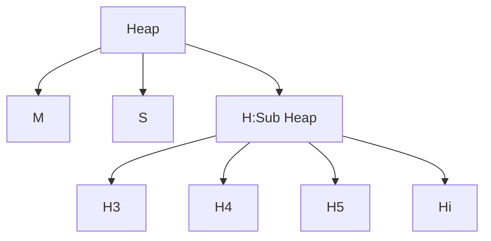

# 【Zig】Bog Gc デザイン

Bog は、Zig で開発された小型のスクリプト言語です。その GC のデザインは、[An efficient of Non-Moving GC for Function languages](https://www.pllab.riec.tohoku.ac.jp/papers/icfp2011UenoOhoriOtomoAuthorVersion.pdf)という論文に触発されました。

## 概要

1. 概要
   - ヒープの設計
   - GC の種類
   - Bitmap の設計
2. 実装

## 概要

GC はガベージコレクションのメカニズムであり、主に`heap`エリアのメモリ管理戦略を対象としています。ヒープ内のメモリの割り当ては指数関数的に増加するサイズで行われ、非常に大きなオブジェクト専用の特別なサブヒープもあります。この方法の一つの利点は、様々なサイズのメモリ要求を効率的に処理できることかもしれません。

公式で表現すると:

$$
Heap = (M, S, (H_3, H_4, ..., H_{12}))
$$

ここで：

1. M は大きなオブジェクトを格納するための特別な領域
2. S は空き領域
3. H は小さなオブジェクトを格納するためのサブヒープで、$H_i$は$2^i$のサイズのサブヒープを示しており、毎回追加されるのは前回の 2 倍のサイズ



```bash
+------------+
|  Container |
|  +------+  |
|  |Box 1|  |
|  +------+  |
|  +------+  |
|  |Box 2|  |
|  +------+  |
|  +------+  |
|  |Box 3|  |
|  +------+  |
+------------+
```

### メモリサブヒーププール

メモリリソースプールを設計します。このプールは、固定サイズの多数のアロケーションセグメントで構成されています。これは、サブヒープがどれだけのスペースを要求しても、これらの固定サイズの「セグメント」単位で要求されることを意味します。例えば、プールのアロケーションセグメントのサイズが 1MB の場合、サブヒープは 1MB、2MB、3MB などのサイズのスペースを要求することができ、1.5MB や 2.5MB のような非整数倍のサイズを要求することはありません。

固定サイズのセグメントで構成されるリソースプールから動的にスペースを割り当てて回収するこの戦略は、高い柔軟性を提供し、メモリの使用効率を向上させる可能性があります。

### GC のカテゴリ

一般的な GC には多くのタイプがあります。

**ビットマップでデータを記録**するという観点から、"世代型ガベージコレクション GC"があります。世代型ガベージコレクションでは、"世代"や"ジェネレーション"はビットマップを指すわけではありません。実際には、メモリの一部でオブジェクトを格納するためのものを指します。GC は、オブジェクトの生存期間に基づいて、異なる世代にそれらを分類します。この戦略の背後にある基本的な考え方は、新しく作成されたオブジェクトはすぐにガベージになり、古いオブジェクトはより長く生き残る可能性が高いということです。

通常、世代型 GC には、2 つの主要な世代があります：

1. **新生世代 (Young Generation)**：新しく作成されたオブジェクトは最初にここに配置されます。新生世代のスペースは通常小さく、ガベージコレクションが頻繁に行われます。

2. **老年世代 (Old or Tenured Generation)**：オブジェクトが新生世代で十分な時間生存し、多くのガベージコレクションを経験した後、老年世代に移動されます。老年世代のスペースは通常新生世代よりも大きく、ガベージコレクションの頻度は低いです。これは、老年世代のオブジェクトがより長い生存期間を持つことが予想されるためです。

ビットマップは、各世代内でどのオブジェクトがアクティブ（つまり、まだ使用中）で、どれがガベージであるかを追跡し、管理するためのツールです。アルゴリズムが世代型 GC に拡張された場合、同じヒープスペースの異なる世代ごとに複数のビットマップを保持できます。これにより、各世代のアクティブなオブジェクトと非アクティブなオブジェクトを個別に追跡できます。

「新生世代には 1 つのビットマップを、老年世代には別のビットマップを保持する」ということは、ガベージコレクションを実行する際に、各世代を個別に考慮することができ、ガベージコレクションの効率とパフォーマンスを最適化することができます。

**古いデータを移動するかどうか**という観点から、"移動型 GC"と"非移動型 GC"があります。移動型 GC は、生存しているオブジェクトを新しいメモリアドレスに移動し、メモリを圧縮します。一方、非移動型 GC は、生存しているオブジェクトを移動せず、メモリ内のデータを他の言語からシームレスに呼び出すことができます。

この移動型 GC には、「世代別コピーコレクタ」と「Cheney コピーコレクタ」があります。

**世代別コピーコレクタ(Generational Copying Collector)**：これは、特に関数型プログラミング言語でのガベージコレクションの一般的な方法です。新しく作成されたオブジェクトはすぐにアクセス不能（すなわち「死んで」）になると仮定し、古いオブジェクトはより長く生きる可能性が高いと仮定します。このタイプの GC は、オブジェクトの移動を行い、ガベージを収集します。

**Cheney のコピーガベージコレクタ**: これはセミスペース（semi-space）のためのコピーガベージコレクタの一種です。使用可能なメモリを二つの半分に分割し、一方の半分だけでオブジェクトを割り当てる方法で動作します。この半分が埋まると、コレクタは活動中のオブジェクトをもう一方の半分にコピーすることによってガベージコレクションを行います。その後、最初の半分は完全にクリアされ、新たな使用可能なスペースとなります。Cheney のコレクタは、短いライフサイクルのデータの処理に特に適しており、活動中のデータのみを迅速にコピーし、死んだデータを無視することができます。これにより、多くの短いライフサイクルのデータを持つプログラム（例：関数型プログラミング）での「マイナーコレクション」（新生代のデータのみを回収するコレクション）が非常に効率的になります。**この方法の利点は、メモリの断片化を効果的に処理できることです。新しい位置に活動中のオブジェクトをコピーすることで、メモリが連続して使用されるためです。**

特徴:

- **正確な copy gc は、すべてのヒープ割り当てデータのポインタをランタイムシステムが識別し、更新する必要があります。**
- 伝統的なガベージコレクションの戦略（移動型 GC）では、圧縮は一般的な技術であり、活動中のオブジェクトをメモリの連続したエリアに移動し、未使用のメモリを解放します。言い換えれば、メモリの断片化を整理します。

非移動型 GC には「マークアンドスイープ」があります。

**圧縮やオブジェクトの移動を必要としないという特性は非常に重要です。**ポインタの値（すなわちオブジェクトのメモリアドレス）は固定されており、移動したアドレスを更新するための時間も必要ありません。このため、非移動型 GC は他の言語との連携が必要な言語に非常に適しています。オブジェクトを移動する必要がないという特性は、ネイティブマルチスレッドをサポートする場面でも有利です。マルチスレッド環境では、オブジェクトがメモリ内で頻繁に移動すると、スレッド間の調整や同期が複雑になります。したがって、オブジェクトの移動を避けることで、マルチスレッドプログラミングが簡単になります。

利点（リテン）:

1. **ロックの簡素化**: マルチスレッド環境において、オブジェクトが移動する必要がある場合（例：ガベージコレクションの圧縮フェーズで）、他のスレッドがオブジェクトを移動中にアクセスしないように確認する必要があります。これは、複雑なロック戦略や同期メカニズムを使用することを意味します。しかし、オブジェクトが決して移動しない場合、このような同期の必要性を減少させ、ロックの戦略を簡単にすることができます。

2. **ポインタの安定性**: マルチスレッドプログラムでは、スレッド間でオブジェクトへのポインタや参照を共有する可能性があります。オブジェクトがメモリ内で移動すると、そのオブジェクトを共有している全てのスレッドがポインタや参照を更新する必要があります。これは同期の複雑さを増加させるだけでなく、野生のポインタなどのエラーを引き起こす可能性があります。オブジェクトが動かない場合、これらのポインタは常に有効です。

3. **予測性とパフォーマンス**: オブジェクトを移動しないことは、メモリアクセスのパターンがより安定して予測可能であることを意味します。マルチスレッドプログラムにおいて、予測性は貴重な特性であり、スレッド間の競合を減少させ、全体的なパフォーマンスを向上させることができます。

4. **一時停止時間の短縮**: ガベージコレクションの中でのオブジェクトの移動は、全てのスレッドを一時停止して安全に移動を行う必要があるため、アプリケーションの顕著な一時停止を引き起こす可能性があります。マルチスレッド環境では、この一時停止は更に顕著になるかもしれません。オブジェクトを移動しないことで、このような一時停止を減少させることができます。

5. **他の言語やシステムとの相互運用性**: あなたのマルチスレッドアプリケーションが他の言語（例：C や C++）やシステムと相互運用する場合、オブジェクトの安定した位置は、外部コードがオブジェクトが移動しない事実に依存している可能性があるため、より重要になります。

しかし、非移動型 GC にも欠点があります：

1. **メモリの断片化**: オブジェクトが移動しないため、メモリ内の空きスペースが不連続になる可能性があります。これは、メモリの断片化を引き起こし、メモリの使用効率を低下させる可能性があります。

2. **メモリの割り当て**: メモリの断片化のため、メモリの割り当てがより複雑になる可能性があります。たとえば、割り当ての要求を満たすための十分な連続したスペースがない場合、アロケータは利用可能なスペースを見つけるためにより多くの作業を行う必要があります。これは割り当てのパフォーマンスを低下させる可能性があります。

3. **メモリの使用**: メモリの断片化のため、メモリの使用が非効率的になる可能性があります。例えば、大きなオブジェクトがあり、それを格納するための十分な連続したスペースがない場合、それは複数の断片に分割される可能性があります。これは、メモリの使用率を低下させる可能性があります。

4. **メモリの占有**: 上記と同じ理由で、メモリの占有も効率が低くなる可能性があります。
   ......

これらの問題を解決するためには多くの複雑な手順が必要であり、ここでは詳しく説明しない。Bog の GC を例に取る。

### Meta Bitmap

「メタレベルビットマップ」または「meta-level bitmaps」とは、元のビットマップの内容を集約するためのより高度なビットマップです。この階層構造は、ファイルシステムの inode マッピングやコンピュータメモリ管理での多段階ページテーブルの使用に似ています。

例として、シンプルなビットマップ`1100 1100`を考えます。メタレベルビットマップは、4 ビットごとに空きブロックがいくつあるかを示すかもしれません。この場合、メタレベルビットマップは`1021`となります（最初の 4 ビットには 1 つの空きブロックがあり、次の 4 ビットには 2 つの空きブロックがあります）。

システムは単にビットマップの最初から空きビットを探すだけではなく、前回見つけた場所を覚えています。これにより、次回の検索はこの位置から開始することができ、検索プロセスをさらに高速化します。これは、メモリのサイズに関係なく、次の空きビットを見つけるための時間がほぼ同じであるという、非常に効率的な性能特性を意味します。

最悪のケースではどうなるでしょうか？

32 ビットアーキテクチャを考慮します。32 ビットアーキテクチャとは、コンピュータの命令セットとデータパスが 32 ビット幅のデータユニットを処理するように設計されていることを意味します。したがって、32 ビットデータユニット（例えば、整数やビットマップの一部）を操作する際、このようなアーキテクチャは通常、全ての 32 ビットを一度に処理することができます。これは 32 を基にした対数操作を引き起こし、大きなデータセグメント（例えば、ビットマップ）の場合、32 ビットのブロック/セグメントで操作する必要がある可能性があります。**探索時間は segmentSize のサイズと対数的な関係がある**。

例えば、ビットマップが 320 ビットの場合、32 ビットアーキテクチャでは、最悪の場合、空きビットを見つけるために 10 の 32 ビットブロックを調べる必要があるかもしれません。これは log32(320)で示され、結果は 10 となります。

### Bitmap

Bog の GC は基本的に「マーク-スイープ」を使用しているため、ビットマップを使用してデータを記録することは不可欠です。Bog では、「ビットマップデータ記録」方式を採用して GC を行っています。そして、効率を向上させるために、メタビットマップという概念を追加しました。つまり、4 つの要素が 1 つのメタビットマップに対応し、使用空間の状態を記録し、heap のオブジェクト時間に応じて深さを増やしています。

### 実装

実際に、Bog のデザインでは、もっと複雑になっています。私たちは追加しました：

```zig
const Page = struct {
    const max_size = 1_048_576;
    comptime {
        // 2^20, 1MiB
        assert(@sizeOf(Page) == max_size);
    }
    const val_count = @divFloor(max_size - @sizeOf(u32) * 2, (@sizeOf(Value) + @sizeOf(State)));
    const pad_size = max_size - @sizeOf(u32) * 2 - (@sizeOf(Value) + @sizeOf(State)) * val_count;
    ...
}
```

1. `max_size`: これは、Page が保存できる最大バイト数を示しています。1 MiB のサイズを示す定数を定義し、コンパイル時に Page タイプのサイズが正確に 1 MiB であることを確認します。そうでなければ、コンパイル時エラーが発生します。
2. `val_count`: これは、Page が保存できる Value オブジェクトの数を示しています。
3. `pad_size`: これは、最大数の Value オブジェクトを保存した後に、Page に残った未使用のスペースのサイズを示しています。

```zig

    const State = enum {
        empty,
        white,
        gray,
        black,
    };
    const List = std.ArrayListUnmanaged(*Page);
    meta: [val_count]State,
    __padding: [pad_size]u8,
    free: u32,
    marked: u32,
    values: [val_count]Value,
```

1. `State` という名前の列挙型を定義しました。これには 4 つの可能な値があります：empty、white、gray、black。
   - ガベージコレクション（GC）の文脈では、これらの状態は通常、GC プロセス中のオブジェクトの状態に関連しています。例えば、世代ガベージコレクションにおいて、オブジェクトは"white"（未訪問/処理待ち）、"gray"（訪問済みだがその参照はまだ処理されていない）、または"black"（処理済み）としてマークされることがあります。
2. `List`: Page タイプのポインタを保存します。
3. `meta`: 一つの Page 内の各 Value オブジェクトの状態を示します。ここでは、状態を示すために列挙型を使用しています。状態は 4 つしかないため、2 ビットで表すことができます。したがって、一つの Page 内のすべての Value オブジェクトの状態を示すために u32 を使用することができます。各 State は values フィールド内の Value オブジェクトの状態に対応する可能性があります。
4. `__padding` というフィールドがあり、これは追加のメモリスペースを埋めるためのものです。そのサイズは以前に述べた pad_size によって決定され、u8 の配列です。これは通常、データ構造のメモリアラインメントを確保するために使用されます。
5. `free`: 空きまたは利用可能なスペースの数量、インデックス、またはその他のメモリ管理に関連する情報を示します。
6. `marked`: マークされたスペースの数量、インデックス、またはその他のメモリ管理に関連する情報を示し、ガベージコレクションの過程でこのページ内で値をチェックするかどうかを検出するために使用されます。
7. `values`: Page 内の Value オブジェクトを示します。これは val_count によって決定される Value オブジェクトの配列です。
