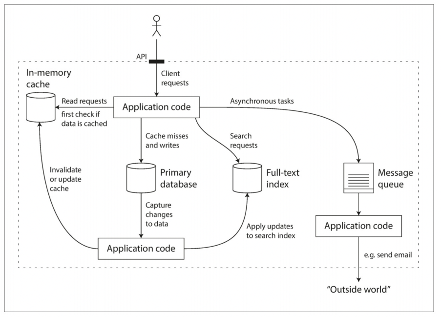
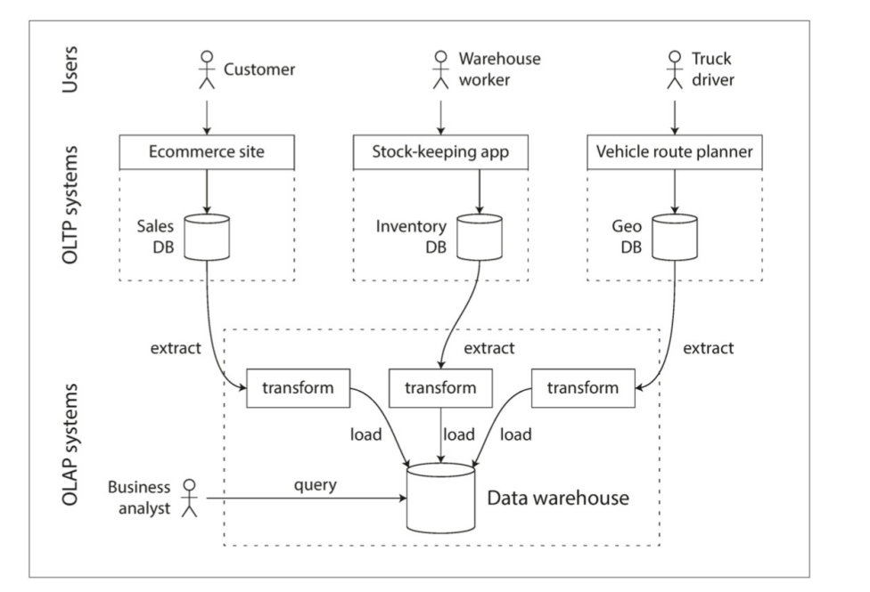
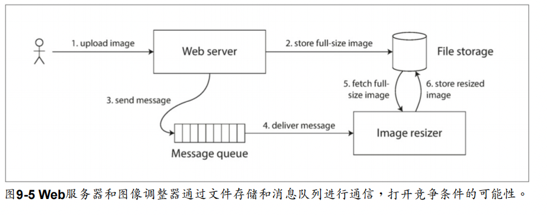

# DDIA - Design Data-intensive Application

总结:

1. 本书:DDIA(设计数据密集型应用)非常适合多次阅读。
2. 对数据的流动、分布式的设计非常详细。
3. 主要是对数据的架构以及一些常见问题的设计思路。具备很强的教学意义。

梗概:

1. 数据系统的基础
2. 分布式数据的基础
3. 衍生数据
   1. 批处理-Hadoop
   2. 流处理

## 数据系统的基础

梗概:

1. 常见基础术语: 可靠性、可扩展性、可维护性
2. 数据模型
3. 存储引擎内部
4. 数据编码

## 分布式数据的基础

1. 基础架构: 共享内存架构、共享磁盘架构、无共享架构、共享无线架构、消息传递架构

数据系统的图:


**描述负载**

负载可以用负载参数的数字来描述: 每秒的请求、数据库中的读写比率、聊天室中同时活跃的用户数量、缓存命中率等

**描述性能**

**吞吐量**: 每秒可以处理的记录数量，或者特定规模数据集上运行作业的总时间
**延迟**: 从请求发出到收到响应的时间
**排队延迟**: 请求在队列中等待处理的时间

### 数据模型

**对象关系不匹配**: 模型之间的不连贯有是时候被成为阻抗不匹配

**图数据模型**: 图数据模型是一种更加通用的数据模型，它可以表示任何对象以及对象之间的关系，多对多，有顶点和边组成
Cypher 查询语言: Neo4j 图行数据库的查询语言

```sql
MATCH (p:Person)-[:FRIENDS]->(f:Person) RETURN p.name, f.name
```

三元组存储:所有信息都以非常简单的三部分表示形式存储（主语，谓语，宾语）

**文档数据模型**: 文档数据库的数据模型是一种半结构化数据模型，它以树形结构存储记录，树的每个节点都是一个文档，文档是一种键值对的集合，值可以是标量、数组或者嵌套的文档

SPARQL: 是一种用于三元组存储的面向 RDF 数据模型的查询语言

### 存储引擎内部

SSTable, LSM, B 树, B+树, 位图索引, 哈希索引, LSM 树, 事务, 日志, MVCC, 二阶段提交, 三阶段提交, 乐观并发控制, 串行化, 快照隔离, 可重复读, 读已提交

#### SSTable

SSTable： 一种存储有键值对的不可变数据结构，通常用在一些数据库和文件系统中，SSTable 通常用于实现一些简单的键值存储，如 LevelDB、RocksDB、HBase、Cassandra 等, SSTables 是不可变的，意味着一旦它们被写入，就不能被修改或删除。

SSTable 的主要特点包括：

1. **不可变性**: SSTables 一旦写入，就不会改变。这有助于提供更快的读取速度和更好的数据一致性。
2. **有序**: 数据在 SSTable 中是按键排序的。这有助于快速查找和读取数据。
3. **持久存储**: 作为一种文件格式，SSTables 保存在磁盘上，提供持久存储。
4. **效率**: 通过索引和压缩等技术，SSTables 能高效地存储和检索数据。
5. **合并和压缩**: 因为 SSTables 是不可变的，所以更新和删除操作通常涉及创建新的 SSTables，并定期进行合并和压缩操作来优化存储和性能。

#### LSM

性能优化: 当查找数据库中不存在的键时，LSM 树算法可能会很慢：您必须检查内存表，然后将这些段一直到最老的（可能必须从磁盘读取每一个），然后才能确定键不存在。为了优化这种访问，存储引擎通常使用额外的 Bloom 过滤器

#### 布隆过滤器

布隆过滤器：一种空间效率极高的概率数据结构，用于测试一个元素是否是集合的成员。

布隆过滤器的一个重要特点是，它可能会产生误判（false positive），也就是说，它可能会错误地认为一个元素存在于集合中，但它不会产生误判（false negative），如果它说一个元素不在集合中，那么该元素一定不在集合中。

用于近似集合内容的内存高效数据结构，它可以告诉您数据库中是否出现键，从而为不存在的键节省许多不必要的磁盘读取操作

布隆过滤器的基本原理：

1. **初始化**：布隆过滤器是一个由多个二进制位（通常为 0 和 1）组成的数组。

2. **添加元素**：当一个元素加入布隆过滤器时，该元素通过多个哈希函数进行哈希，生成几个哈希值，然后把这些哈希值对应的布隆过滤器中的位置标记为 1。

3. **查询元素**：要检查一个元素是否在布隆过滤器中，用同样的哈希函数生成哈希值，查看这些哈希值对应的位置是否都是 1。如果都是 1，该元素可能在布隆过滤器中；如果有任何一个位置是 0，那么该元素肯定不在布隆过滤器中。

4. **误判**：由于多个不同的元素可能会有相同的哈希值（哈希碰撞），所以布隆过滤器有可能误判一个元素存在于集合中。

5. **不可删除**：布隆过滤器的另一个特点是不能从中删除元素。如果需要删除元素，通常的做法是创建一个新的布隆过滤器。

应用场景：

布隆过滤器广泛用于各种应用场景，特别是在需要快速、高效检查元素存在性的场合。例如：

1. **网络应用**：用于快速检查一个网络资源（例如 URL 或 IP 地址）是否存在于一个巨大的集合中。

2. **数据库**：用于减少磁盘查找，如果布隆过滤器说一个元素不存在，就不需要在磁盘上进一步查找。

3. **缓存系统**：用于快速判断一个数据是否在缓存中。

4. **广告系统**：用于快速判断一个广告是否已经被用户看过。

优缺点：

- **优点**：

- 空间效率高。
- 查询速度快。

- **缺点**：
- 有一定的误判率。
- 不能删除元素。



### 数据编码

论如何使用这些格式进行数据存储和通信：在 Web 服务中，具象状态传输（**REST**）和远程过程调用（**RPC**），以及**消息传递系统**（如 Actor 和消息队列）

程序通常有 2 种形式的数据：

1. 内存里的高效优化，使用指针
2. 网络则是编码 JSON。 由于每个进程都有自己独立的地址空间，一个进程中的指针对任何其他进程都没有意义，所以这个字节序列表示会与通常在内存中使用的数据结构完全不同(除一些特殊情况外，例如某些内存映射文件或直接在压缩数据上操作, 如“列压缩”中所述)
   - 编码(序列化 serialization|编组 marshalling|encoding): 从内存中表示到字节序列的转换
   - Marshal 和 Serialization 的区别: Marshal 不仅传输对象的状态，还会传输对象
   - 为了恢复相同对象类型的数据，解码过程需要实例化任意类的能力，这通常是安全问题
     的一个来源：如果攻击者可以让应用程序解码任意的字节序列，他们就能实例化任意的类，这会允许他们做可怕的事情，如远程执行任意代码。

## 分布式数据的基础

数据分布在多个节点上有: 复制、分区

### 复制

复制的困难之处在于处理复制数据的变更（change）。论三种流行的变更复制算法：单领导者（single leader），多领导者（multi leader）和无领导者（leaderless）。

### 协同编辑

处理写入冲突时，是多领导者复制导致的问题。

同步与异步的冲突检测: 在单主数据库中，第二个写入将被阻塞，并等待第一个写入完成，或中止第二个写入事务，强制用户重试。另一方面，在多活配置中，两个写入都是成功的，并且在稍后的时间点仅仅异步地检测到冲突。那时要求用户解决冲突可能为时已晚。原则上，可以使冲突检测同步 - 即等待写入被复制到所有副本，然后再告诉用户写入成功。但是，通过这样做，您将失去多主复制的主要优点：允许每个副本独立接受写入。如果您想要同步冲突检测，那么您可以使用单主程序复制。

#### 收敛至一致的状态

单主数据库按顺序应用写操作: 如果同一个字段有多个更新，则最后一个写操作将确定该字段的最终值。
多主配置: 如果每个副本只是按照它看到写入的顺序写入，那么数据库最终将处于不一致的状态：最终值将是在多个主库决定。这是不可接受的，每个复制方案都必须确保数据在所有副本中最终都是相同的。

##### 多种途径

实现冲突合并解决有多种途径：

1. 给每个写入一个唯一的 ID（例如，一个时间戳，一个长的随机数，一个 UUID 或者一个键和值的哈希），挑选最高 ID 的写入作为胜利者，并丢弃其他写入。如果使用时间戳，这种技术被称为最后写入胜利（LWW, last write wins）。虽然这种方法很流行，但是很容易造成数据丢失。
2. 为每个副本分配一个唯一的 ID，ID 编号更高的写入具有更高的优先级。这种方法也意味着数据丢失。
3. 以某种方式将这些值合并在一起 - 例如，按字母顺序排序，然后连接它们。
4. 在保留所有信息的显式数据结构中记录冲突，并编写解决冲突的应用程序代码（也许通过提示用户的方式）

自定义：

1. 写时执行。

##### 自动冲突解决

1. 无冲突复制数据类型(Conflict-free replicated datatypes, CRDT): 可以由多个用户同时编辑的集合，映射，有序列表，计数器等的一系列数据结构，它们以合理的方式自动解决冲突
2. 可合并的持久数据结构（Mergeable persistent data structures）: 显式跟踪历史记录，类似于 Git 版本控制系统，并使用三向合并功能（而 CRDT 使用双向合并）。
3. 可执行的转换（operational transformation）: Etherpad 和 GoogleDocss 等合作编辑应用背后的冲突解决算法。它是专为同时编辑项目的有序列表而设计的，例如构成文本文档的字符列表。

##### Dynamo 风格的数据存储

读修复(Read repair): 当客户端并行读取多个节点时，它可以检测到任何陈旧的响应
反熵过程（Anti-entropy process）： 一些数据存储具有后台进程，该进程不断查找副本之间的数据差异，并将任何缺少的数据从一个副本复制到另一个副本。与基于领导者的复制中的复制日志不同，此反熵过程不会以任何特定的顺序复制写入，并且在复制数据之前可能会有显着的延迟。

### 分区

偏斜(skew)和热点(hot spot)问题

KeyRange: 根据键的范围分区, Key Range 分区的缺点是某些特定的访问模式会导致热点。

根据键的散列分区:使用散列函数来确定给定键的分区，一个好的散列函数可以将将偏斜的数据均匀分布。假设你有一个 32 位散列函数,无论何时给定一个新的字符串输入，它将返回一个 0 到$2^{32}$ -1 之间的"随机"数。即使输入的字符串非常相似，它们的散列也会均匀分布在这个数字范围内。这种技术擅长在分区之间分配键。分区边界可以是均匀间隔的，也可以是伪随机选择的（在这种情况下，该技术有时也被称为一致性哈希（consistent hashing））。

#### 一致性哈希

用于跨互联网级别的缓存系统，例如 CDN 中，是一种能均匀分配负载的方法。它使用随机选择的分区边界（partition boundaries）来避免中央控制或分布式一致性的需要。 请注意，这里的一致性与复制一致性（请参阅第 5 章）或 ACID 一致性（参阅第 7 章）无关，而是描述了重新平衡的特定方法。

`hashring` 库的实现基于一致性哈希算法。在这种算法中，每个节点和每个键都通过哈希函数映射到一个固定范围（通常是一个环）上的一个位置。然后根据它们的哈希值将键分配给相应的节点。

以下是一致性哈希的基本步骤：

1. 使用哈希函数计算每个节点的哈希值。
2. 在哈希值的环上放置每个节点。
3. 使用相同的哈希函数计算每个键的哈希值。
4. 同样在哈希值的环上放置每个键。
5. 为每个键找到最近的节点（在顺时针方向上）。

关于如何将数据插入到数据库，这与一致性哈希没有直接关系。一致性哈希只是一种将键分配到不同节点的方法。实际将数据插入到数据库的过程需要使用数据库的 API 或 SQL 语句。例如，你可以使用一致性哈希来决定将哪些数据存储到哪些数据库服务器上，但实际的存储操作还是需要用数据库的标准操作来完成。

如果我们拓展之前的示例，可以加入将数据存储到数据库的逻辑。以下是一个非常简单的例子，只是为了给你一个基本的概念：

```javascript
const HashRing = require("hashring");
const nodes = ["node1", "node2", "node3", "node4"];

const ring = new HashRing(nodes);
const keys = ["user1", "user2", "user3", "user4", "user5", "user6"];

keys.forEach((key) => {
  const node = ring.get(key);
  console.log(`Key ${key} is mapped to node ${node}`);

  // 假设每个节点对应一个数据库，这里你可以使用数据库的 API 来将数据实际存储到数据库中
  // 以下只是一个伪代码示例
  /*
  const db = connectToDatabase(node);
  db.insert({ key, data: 'some data' });
  */
});
```

在这个示例中，我们假设每个节点对应一个数据库（这只是为了说明，实际情况可能会更复杂）。我们可以使用一致性哈希来决定将键存储到哪个节点（即哪个数据库），然后使用相应的数据库 API 或 SQL 语句来实际执行存储操作。这里的 `connectToDatabase` 和 `db.insert` 是伪代码，你需要根据实际使用的数据库来实现相应的操作。

##### Hash Ring

当然！以下是一个使用 Node.js 手动实现一致性哈希的简单示例。这个示例中包含一个 `HashRing` 类，用于添加节点、删除节点和获取键的节点。

1. 首先，我们将使用 `crypto` 库来生成哈希值。我们也使用一个排序数组来存储环上的哈希值，以便我们可以找到给定键的正确节点。

2. 然后，我们使用 `bisect` 函数来找到给定哈希值在排序数组中的位置。

3. 最后，我们使用这个位置来找到相应的节点。

以下是完整的示例代码：

```javascript
const crypto = require("crypto");

class HashRing {
  constructor(nodes = []) {
    this.nodes = nodes;
    this.ring = {};
    this.sortedHashes = [];
    nodes.forEach((node) => this.addNode(node));
  }

  hash(key) {
    const hash = crypto.createHash("md5").update(key).digest("hex");
    return parseInt(hash, 16);
  }

  addNode(node) {
    const hash = this.hash(node);
    this.ring[hash] = node;
    this.sortedHashes.push(hash);
    this.sortedHashes.sort((a, b) => a - b);
  }

  removeNode(node) {
    const hash = this.hash(node);
    delete this.ring[hash];
    const index = this.sortedHashes.indexOf(hash);
    if (index >= 0) {
      this.sortedHashes.splice(index, 1);
    }
  }

  get(key) {
    if (this.sortedHashes.length === 0) {
      return null;
    }

    const hash = this.hash(key);
    let index = this.sortedHashes.findIndex((sortedHash) => hash <= sortedHash);
    if (index === -1) {
      index = 0; // Wrap around to the first node
    }

    const nodeHash = this.sortedHashes[index];
    return this.ring[nodeHash];
  }
}

// 示例用法
const hashRing = new HashRing(["node1", "node2", "node3"]);
console.log(hashRing.get("user1")); // 输出应该分配到的节点名
console.log(hashRing.get("user2")); // 输出应该分配到的节点名
```

在这个示例中，`HashRing` 类有一个构造函数，用于初始化哈希环，和三个方法：

- `hash` 方法用于计算给定键或节点的哈希值。
- `addNode` 和 `removeNode` 方法用于添加和删除节点。
- `get` 方法用于获取给定键的节点。

你可以根据需要扩展这个示例，例如，支持虚拟节点以使哈希环更均匀，或者优化哈希函数和环的数据结构等。

#### 负载倾斜与消除热点

在极端情况下，所有的读写操作都是针对同一个键的，所有的请求都会被路由到同一个分区。

解决：添加随机数

### 一致性和共识

分布式系统最重要的抽象之一就是共识（consensus）：就是让所有的节点对某件事达成一致。

如果两个节点都认为自己是领导者，这种情况被称为脑裂（split brain），且经常导致数据丢失

线性一致性背后的基本思想很简单：使系统看起来好像只有一个数据副本。

线性一致性的要求是，操作标记的连线总是按时间（从左到右）向前移动，而不是向后移动。这个要求确保了我们之前讨论的新鲜性保证：一旦新的值被写入或读取，所有后续的读都会看到写入的值，直到它被再次覆盖。

ZooKeeper 和 etcd 提供线性一致性的写操作，但读取可能是陈旧的，因为默认情况下，它们可以由任何一个副本服务。你可以选择请求线性一致性读取：etcd 调用这个法定读取【16】，而在 ZooKeeper 中，你需要在读取【15】之前调用 sync() 。参阅“使用全局顺序广播实现线性存储”。

**锁定和领导选举**： 一个使用单主复制的系统，需要确保领导真的只有一个，而不是几个（脑裂）。一种选择领导者的方法是使用锁：每个节点在启动时尝试获取锁，成功者成为领导者【14】。不管这个锁是如何实现的，它必须是线性一致的：所有节点必须就哪个节点拥有锁达成一致，否则就没用了

**跨信道的时序依赖**


两阶段提交（2PC）和两阶段锁定（参阅“两阶段锁定（2PL）”）是两个完全不同的东西。 2PC 在分布式数据库中提供原子提交，而 2PL 提供可序列化的隔离等级。

## 批处理

许多现有数据系统中都采用这种数据处理方式：你发送请求指令，一段时间后(我们期望)系统会给出一个结果。数据库，缓存，搜索索引，Web 服务器以及其他一些系统都以这种方式工作。

**服务（在线系统）**
服务等待客户的请求或指令到达。每收到一个，服务会试图尽快处理它，并发回一个响应。响应时间通常是服务性能的主要衡量指标，可用性通常非常重要（如果客户端无法访问服务，用户可能会收到错误消息）

**批处理系统（离线系统）**

一个批处理系统有大量的输入数据，跑一个作业（job）来处理它，并生成一些输出数据，这往往需要一段时间（从几分钟到几天），所以通常不会有用户等待作业完成。相反，批量作业通常会定期运行（例如，每天一次）。批处理作业的主要性能衡量标准通常是吞吐量（处理特定大小的输入所需的时间）。本章中讨论的就是批处理。

**流处理系统（准实时系统）**

流处理介于在线和离线（批处理）之间，所以有时候被称为准实时（near-real-time）或准在线（nearline）处理。像批处理系统一样，流处理消费输入并产生输出（并不需要响应请求）。但是，流式作业在事件发生后不久就会对事件进行操作，而批处理作业则需等待固定的一组输入数据。这种差异使流处理系统比起批处理系统具有更低的延迟。流处理基于批处理。
