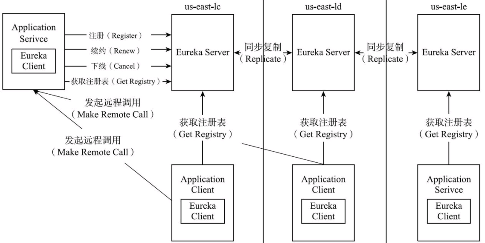

# Spring Cloud 微服务架构进阶

推荐工具:

1. [Spring Initializer](https://start.spring.io/): 可以直接生成相应版本的包
2. [Spring IO Repo](https://repo.spring.io/ui/native/milestone/org/springframework/cloud/spring-cloud-netflix-ribbon/): 可以直接下载相应版本的包

针对的版本:

- Java: 17
- Spring Boot: 3.2.0-SNAPSHOT
- Spring Cloud: 2023.0.0-SNAPSHOT

目录:

1. 概述
2. 总览: Spring Boot(服务注册和发现、熔断机制、服务路由、分布式配置中心、消息总线、负载均衡、链路监控)
3. Spring Boot 基础
4. 服务注册与发现: Eureka
5. OpenFeign
6. Hystrix
7. Ribbon
8. API Gateway
9. Config server
10. Stream
11. Bus - 消息总线
12. Security
13. Sleuth - 链路监控

## 1. 概述

早起 SOA 架构时期，Java 打包成 War 包。后来随着微服务架构的兴起，Java 打包成 Jar 包。Spring Boot 是一种快速开发框架，可以快速构建微服务架构。

### 微服务组成

1. 服务注册、发现
2. 负载均衡
3. 服务网关： 服务的唯一入口。实现用户鉴权、动态路由、灰度发布、A/B 测试、负载限流
4. 配置中心：实现开发、测试、生产环境中无差别性
5. 服务监控：监控服务的运行状态
6. 支撑平台：健康检查、性能健康

缺点：

1. 运维要求高
2. 分布式系统的复杂性
3. 接口调整困难
4. 重复劳动

#### 常见流派

四种类型架构：ZeroCIceGrid, 基于消息队列, Docker Swarm, Spring Cloud

1. ZeroCIceGrid: RPC 框架 Ice 的分布式部署方案
2. 基于消息队列: 通过消息队列实现服务之间的通信。微服务之间采用发布消息、舰艇消息的方式进行通信。**MQ 是关键**。
3. Docker Swarm: Docker 容器的集群管理方案。Compose 编排应用，通过 yaml 来定义应用的服务，在 Swarm 集群中部署应用
4. SC：核心功能和组件

#### 云原生和微服务

云原生：

1. 容器化封装
2. 动态管理，集中式的编排调度系统
3. 面向微服务

## 2. 总览

组成：

1. 服务注册和发现：Eureka, Zookeeper, Consul
2. 服务调用: Hystrix, Ribbon, Feign
3. 路由和过滤组件: zuul, spring cloud gateway
4. 分布式配置中心: Spring Cloud Config
5. 服务监控: Spring Boot Admin, Spring Cloud Sleuth, Zipkin

命令行工具:

- Spring Cloud CLI: [Spring Initializr](https://start.spring.io/)

特性:

- Spring cloud Context: context 提供了大量的实用工具和特性服务
- Spring cloud Commons: 通用组件，为其他组件 Eureka, Consul 提供抽象封装

### Spring Cloud Context

除了应用的 context 配置: application.yml / application.properties，还需要额外提供配置 Bootstrap.yml / Bootstrap.properties

- Bootstrap 的属性优先级高于 application 的属性优先级

下面是一个 bootstrap.yaml 的例子:

```yaml
spring:
  application:
    name: config-client
  cloud:
    config:
      uri: ${CONFIG_SERVER:http://localhost:8888}
      name: config-client
      profile: dev
      label: master
```

禁止 bootstrap 引导加载配置文件

```yaml
spring:
  cloud:
    bootstrap:
      enabled: false
```

特性：

- Spring 的子级上下文将从父级中继承属性源和配置文件。
- 如果采用 SpringApplication / SpringApplicationBuilder 来构建，则 Bootstrap 就会成为父级的上下文。

修改 Bootstrap 的配置文件的位置：

- 如果要修改 Bootstrap 的配置文件的位置，可以在配置属性中的`spring.cloud.bootstrap.location`中指定。

重载远程属性：

```yaml
spring:
  cloud:
    config:
      override-system-properties: false # 默认为 true，近覆盖远程属性中的系统属性和环境变量
      overrideNone: false # 默认为 true，本地属性覆盖所有远程属性
```

### Spring Cloud Commons

服务发现、负载均衡、断路器等封装在一个公共抽象中

- @EnableDiscoveryClient: 服务发现，自动将本地的 spring boot 应用注册到服务注册中心

## 3. Spring Boot 基础

spring cloud 全部都基于 spring boot。

特性：

1. 通过 SpringApplication 来引导启动应用程序
2. 外部化配置，以便在不同环境中使用相同的代码
3. spring profiles 将配置文件隔离成不同的模块，这些配置只在特定环境中生效
4. 可以通过 JDBC 来访问数据库到 ORM

### 搭建最简单的 spring boot 项目

pom.xml 里添加:

```xml
	<parent>
		<groupId>org.springframework.boot</groupId>
		<artifactId>spring-boot-starter-parent</artifactId>
		<version>3.2.0-SNAPSHOT</version>
		<relativePath/> <!-- lookup parent from repository -->
	</parent>

  <dependency>
    <groupId>org.springframework.boot</groupId>
    <artifactId>spring-boot-starter-web</artifactId>
  </dependency>
```

### Jetty

如果要避开 Tomcat，而使用别的容器，比如 Jetty：

```xml
		<dependency>
			<groupId>org.springframework.boot</groupId>
			<artifactId>spring-boot-starter-web</artifactId>
			<exclusions>
				<exclusion>
					<groupId>org.springframework.boot</groupId>
					<artifactId>spring-boot-starter-tomcat</artifactId>
				</exclusion>
			</exclusions>
		</dependency>

		<dependency>
			<groupId>org.springframework.boot</groupId>
			<artifactId>spring-boot-starter-jetty</artifactId>
		</dependency>
```

### 配置文件

1. SpringApplication 类会搜索 application.properties 或者 application.yml 文件，并将其加载到 Spring 环境中
   1. 优先级：file:./config/ > file:./ > classpath:/config/ > classpath:/
   2. 可以通过 spring.config.location 来指定配置文件的位置
2. 如果在优先级高的地方找到配置，就会自动忽略低优先级的配置

### 常见的注解

1. 通过 @Value 注解来获取配置文件中的值
2. 通过 @ConfigurationProperties 注解来获取配置文件中的值
3. 通过 @PropertySource 注解来指定配置文件的位置
4. 通过 @ImportResource 注解来导入 xml 配置文件
5. 通过 @Profile 注解来指定配置文件的 profile

### 外部化配置

1. cli 参数
2. 通过 System#getProperty()获取
3. 操作系统的环境变量
4. java:comp/env JNDI 属性
5. RandomValuePropertySource 随机值
6. jar 包外部的 application-{profile}.properties 或者 application.yml 配置文件

### 实际例子

```java
java-jar demo.jar --spring.config.location=/opt/config/application.yml
```

- 此处指定的外部文件名无固定要求，可以是任意名字，只要在启动时指定即可
- 如果要加载不同环境的外部配置文件，可以通过 --spring.profiles.active=dev 来指定，此时会加载 application-dev.yml 文件，最好是写成 application-{profile}.yml 的形式

### 自动载入外部属性到 Bean

- @EnableConfigurationProperties 的应用

```yaml
sms:
  retry-limitation-minutes: 1
  type:
    - register
    - login
```

```java
package com.moxi.sirenservice.configs;

import org.springframework.boot.context.properties.ConfigurationProperties;

@ConfigurationProperties(prefix = "sms")
public class SMS {
    private int retryLimitationMinutes;


    // getter, setter
}
```

### 多 Profile

为了在不同环境提供不同的配置，可以和全局的 profile 配合使用。

- 常见是使用 spring.profiles.active=dev 来制定激活具体的 profile
- spring.profiles.include: 用于在激活一个特定的配置文件（profile）时，额外包含（include）其他的配置文件。这将通用配置与特定环境的配置分开，增加了配置的灵活性和可维护性

#### 单文件的多 Profile

```yaml
spring:
  profiles:
    active: dev
---
# dev 环境的配置
spring:
  config:
    activate:
      on-profile: dev
  datasource:
    url: jdbc:mysql://localhost:3306/myapp_dev
---
# prod 环境的配置
spring:
  config:
    activate:
      on-profile: prod
  datasource:
    url: jdbc:mysql://prod-db-host:3306/myapp_prod
```

**注意**:

- spring.profiles 属性已经被弃用，取而代之的是 spring.config.activate.on-profile

#### spring.profiles.include 的使用

common.yaml:

```yaml
logging:
  level:
    root: INFO
myapp:
  feature-flag:
    newFeature: true
```

application-dev.yml:

```yaml
spring:
  profiles:
    include:
      - common
  datasource:
    url: jdbc:mysql://localhost:3306/myapp_dev
```

application-prod.yml:

```yaml
spring:
  profiles:
    include:
      - common
  datasource:
    url: jdbc:mysql://prod-db-host:3306/myapp_prod
```

### spring-boot-starter-web 项目里的常用依赖

- spring-boot-starter: 核心依赖，包括自动配置支持、日志和 YAML
- spring-boot-starter-web: 包括 RESTful、JSON、Web 等
- spring-boot-starter-test: 包括 JUnit、Hamcrest、Mockito 等
- spring-boot-starter-aop: 包括 AOP 编程支持
- spring-boot-starter-actuator: 用于监控和管理应用程序
- spring-boot-starter-data-jpa: 用于访问数据库
- spring-boot-starter-security: 用于安全认证
- spring-boot-starter-cache: 用于缓存
- spring-boot-starter-jdbc: 用于 JDBC 访问
- spring-boot-starter-webflux: 用于构建响应式 Web 应用程序

#### Actuator

- 用于监控和管理应用程序,包含了许多内置端点，可以通过 HTTP 或者 JMX 来访问，[具体链接](https://docs.spring.io/spring-boot/docs/current/reference/html/actuator.html)

如果要开启端点，可以通过 yaml 指定来开启：

```yaml
management:
  endpoints:
    enabled-by-default: true # 统一开启或者关闭端点
    jmx:
      enabled: true # 开启 JMX 端点
      exposure:
        exclude: env,beans # 排除 env 和 beans 端点
        include: "*" # 开启所有的端点
    web:
      exposure:
        include: info,health, beans # 开启 info, health, beans 端点
  endpoint:
    shutdown:
      enabled: true
```

- 在读取配置中心的数据时，可以使用@RefreshScope 来实时刷新数据

## 4. 服务注册与发现

通常包含 2 部分：服务端和客户端。

- 服务端：服务注册中心，用于注册服务，以及服务的健康检查
- 客户端：服务的提供者，将自己注册到服务注册中心，以及从服务注册中心获取服务列表

### 基础概念 Eureka

搭建中所需的最小依赖:

```xml
		<dependency>
			<groupId>org.springframework.boot</groupId>
			<artifactId>spring-boot-starter-actuator</artifactId>
		</dependency>
		<dependency>
			<groupId>org.springframework.boot</groupId>
			<artifactId>spring-boot-starter-web</artifactId>
		</dependency>
		<dependency>
			<groupId>org.springframework.cloud</groupId>
			<artifactId>spring-cloud-starter-netflix-eureka-server</artifactId>
		</dependency>
```

- 在启动类我们需要添加 @EnableEurekaServer 注解来启动服务注册中心

```java
@SpringBootApplication
@EnableEurekaServer
public class DiscoveryServiceApplication {

	public static void main(String[] args) {
		SpringApplication.run(DiscoveryServiceApplication.class, args);
	}

}
```

#### 常见的 yaml 配置

```yaml
server:
  port: 8761

eureka:
  instance:
    hostname: standalone
    instance-id: ${spring.application.name}:${vcap.application.instance_id:${spring.application.instance_id:${random.value}}}:${spring.cloud.client.ip-address}:${server.port}
  client:
    register-with-eureka: false # 是否将自己注册到 Eureka Server，默认为 true
    fetch-registry: false # 是否从 Eureka Server 获取注册信息，默认为 true
    service-url:
      defaultZone: http://${eureka.instance.hostname}:${server.port}/eureka/
```

- VCAP 是与 Cloud Foundry 相关的一个环境变量前缀，代表 "VMware Cloud Application Platform"。在 Cloud Foundry 平台上部署的应用通常会接收到一系列以 VCAP 开头的环境变量，这些环境变量包含了应用运行的关键信息。
- instance-id: 唯一标记。主要用于区分统一服务集群的不同实例

##### 为什么需要这样的 instance-id？

- 在微服务架构中，尤其是在使用服务发现模式的时候，可能有多个实例同时运行相同的应用。为了能夠在 Eureka 服务注册中心中正确识别和区分每个实例，需要一个唯一的标识符。
- 上述配置通过组合应用名称、实例标识、IP 地址和端口号来确保每个实例的 instance-id 是唯一的，这对于负载均衡、服务跟踪和故障排除等方面非常重要。

##### 集群部署

Euereka Server 本身也是一个微服务，因此也可以将其部署成集群。server 之间彼此会进行注册表消息同步，也就是 peer-to-peer 模式。

```yaml
eureka:
  client:
    service-url:
      defaultZone: http://peer1:8761/eureka/,http://peer2:8762/eureka/
```

#### 常见特性

1. Eureka Server 通常会关闭作为客户端注册自己的行为
2. Eureka Server 会缓存所有服务的注册信息，这样就算某个服务在某个时间段不可用，也不会立即清理掉该服务的注册信息
3. Server 会定时（默认 30 秒）去清理那些超时（默认 90 秒）没有续约的服务,也就是发心跳包的服务

### 服务调用者

引入依赖：

```xml
		<dependency>
			<groupId>org.springframework.cloud</groupId>
			<artifactId>spring-cloud-starter-netflix-eureka-client</artifactId>
		</dependency>
    <dependency>
			<groupId>org.springframework.cloud</groupId>
			<artifactId>spring-cloud-starter-loadbalancer</artifactId>
		</dependency>

```

如果要配置 Eureka Client，需要注意在 yaml 中配置的属性名：

```yaml
eureka:
  instance:
    hostname: client
    prefer-ip-address: true
    instance-id: ${spring.application.name}:${vcap.application.instance_id:${spring.application.instance_id:${random.value}}}:${spring.cloud.client.ip-address}:${server.port}
  client:
    service-url:
      defaultZone: http://localhost:8761/eureka/
```

**注意**:

- 如有可能，直接上手 nacos / apollo，会省略许多时间。Eureka 暂时放弃了更新。
- `prefer-ip-address: true` 这段很重要。如果没有单独设置这块，则会以 hostname 为 domain，而这会导致 502 Bad Gateway 问题。

#### 多个服务相互调用

1. Service Provider 服务提供者

SayHelloController.java:

```java
import org.springframework.web.bind.annotation.PathVariable;
import org.springframework.web.bind.annotation.RequestMapping;
import org.springframework.web.bind.annotation.ResponseBody;
import org.springframework.web.bind.annotation.RestController;

@RestController
public class SayHelloController {

    @RequestMapping(value = "/hello/{name}")
    @ResponseBody
    public String sayHello(@PathVariable String name) {
        return "Hello, " .concat(name).concat("!");
    }
}

```

2. Service Consumer 服务消费者

ApplicationContextConfig.java:

```java
import org.springframework.cloud.client.loadbalancer.LoadBalanced;
import org.springframework.context.annotation.Bean;
import org.springframework.context.annotation.Configuration;
import org.springframework.web.client.RestTemplate;

@Configuration
public class ApplicationContextConfig {
    @Bean
    @LoadBalanced
    public RestTemplate restTemplate() {
        return new RestTemplate();
    }
}
```

AskController.java:

```java
import org.springframework.beans.factory.annotation.Autowired;
import org.springframework.beans.factory.annotation.Value;
import org.springframework.context.annotation.Configuration;
import org.springframework.web.bind.annotation.RequestMapping;
import org.springframework.web.bind.annotation.RestController;
import org.springframework.web.client.RestTemplate;

@RestController
@Configuration
public class AskController {
    private static final String SERVICE_NAME = "http://SIREN-SERVICE-DEV/hello/";

    @Value("${spring.application.name}")
    private String name;

    @Autowired
    RestTemplate restTemplate;

    @RequestMapping(value = "/ask")
    public String ask() {
        String askHelloFromService = restTemplate.getForObject(SERVICE_NAME + name, String.class);

        System.out.println("askHelloFromService: " + askHelloFromService);
        return askHelloFromService;
    }
}
```

**注意**:

1. LoadBalanced 需要和 RestTemplate 一起使用，否则会报错，且需要和 consumer 在不同的文件中，否则会报依赖循环
2. 服务提供者的服务名需要大写，否则会报错
3. 服务提供者的服务名需要和服务提供者的 application name 一致，否则会报错
4. 如果出现 502 Bad Gateway，可以通过设置日志来查看具体的错误信息

#### 从注册中心获取实例的数据

ServiceInstanceRestController.java

```java
import java.util.List;
import org.springframework.beans.factory.annotation.Autowired;
import org.springframework.cloud.client.ServiceInstance;
import org.springframework.cloud.client.discovery.DiscoveryClient;
import org.springframework.web.bind.annotation.PathVariable;
import org.springframework.web.bind.annotation.RequestMapping;
import org.springframework.web.bind.annotation.RestController;


@RestController
public class ServiceInstanceRestController {
    @Autowired
    private DiscoveryClient discoveryClient;

    @RequestMapping("/service-instance/{applicationName}")
    public List<ServiceInstance> serviceInstancesByApplicationName(
            @PathVariable String applicationName) {
        return this.discoveryClient.getInstances(applicationName);
    }
}
```

返回的数据:

```json
[
  {
    "scheme": "http",
    "host": "192.168.3.47",
    "port": 8081,
    "secure": false,
    "metadata": { "management.port": "8081" },
    "instanceId": "siren-service-dev:9b18096aa934b3c24e56a80bae72c924:192.168.3.47:8081",
    "uri": "http://192.168.3.47:8081",
    "serviceId": "SIREN-SERVICE-DEV",
    "instanceInfo": {
      "instanceId": "siren-service-dev:9b18096aa934b3c24e56a80bae72c924:192.168.3.47:8081",
      "app": "SIREN-SERVICE-DEV",
      "appGroupName": null,
      "ipAddr": "192.168.3.47",
      "sid": "na",
      "homePageUrl": "http://192.168.3.47:8081/",
      "statusPageUrl": "http://192.168.3.47:8081/actuator/info",
      "healthCheckUrl": "http://192.168.3.47:8081/actuator/health",
      "secureHealthCheckUrl": null,
      "vipAddress": "siren-service-dev",
      "secureVipAddress": "siren-service-dev",
      "countryId": 1,
      "dataCenterInfo": {
        "@class": "com.netflix.appinfo.InstanceInfo$DefaultDataCenterInfo",
        "name": "MyOwn"
      },
      "hostName": "192.168.3.47",
      "status": "UP",
      "overriddenStatus": "UNKNOWN",
      "leaseInfo": {
        "renewalIntervalInSecs": 30,
        "durationInSecs": 90,
        "registrationTimestamp": 1700459596079,
        "lastRenewalTimestamp": 1700459596079,
        "evictionTimestamp": 0,
        "serviceUpTimestamp": 1700459595402
      },
      "isCoordinatingDiscoveryServer": false,
      "metadata": { "management.port": "8081" },
      "lastUpdatedTimestamp": 1700459596080,
      "lastDirtyTimestamp": 1700459595123,
      "actionType": "ADDED",
      "asgName": null
    }
  }
]
```

#### 修改状态页和健康检查页端口的设置

```yaml
server:
  servlet:
    context-path: /eureka

eureka:
  instance:
    status-page-url-path: ${server.servlte.path}/actuator/info
    health-check-url-path: ${server.servlet.path}/actuator/health
```

#### 区域与可用区

Eureka Server:

```yaml
eureka:
  instance:
    metadata-map:
      zone: us-east-zone2
  client:
    region: us-east-1
    prefer-same-zone-eureka: true
    availability-zones:
      us-east-1: zone1, zone2
      us-west-1: zone1, zone2
    service-url:
      us-east-zone1: http://zone1:8761/eureka/
      us-east-zone2: http://zone2:8761/eureka/
```

#### 原理

服务发现的原理的架构图：


### Consul - 另一种服务注册与发现

基于 Go 开发的，并且采用了 raft 算法保证服务的一致性，支持健康检查。

Install:

- Mac: `brew install consul`
- 运行: `consul agent -dev`

#### 搭建

pom:

```xml
    <dependency>
      <groupId>org.springframework.boot</groupId>
      <artifactId>spring-boot-starter-actuator</artifactId>
    </dependency>
    <dependency>
      <groupId>org.springframework.boot</groupId>
      <artifactId>spring-boot-starter-web</artifactId>
    </dependency>
    <dependency>
      <groupId>org.springframework.cloud</groupId>
      <artifactId>spring-cloud-starter-consul-discovery</artifactId>
    </dependency>
```

添加 application.yaml

```yaml
server:
  port: 8083

spring:
  application:
    name: consul-service
  cloud:
    consul:
      discovery:
        instance-id: ${spring.application.name}:${vcap.application.instance_id:${spring.application.instance_id:${random.value}}}:${spring.cloud.client.ip-address}:${server.port}
        service-name: ${spring.application.name}
      host: localhost
      port: 8500
```

运行后打开`http://localhost:8500`，可以看到注册的服务

## 5. OpenFeign

声明式 Restful 网络请求客户端。

- 可以集成 Ribbon 和 Hytrix 来提供负载均衡和熔断机制的支持

使用 OpenFeign 的架构一般分为 3 个部分：

1. 服务注册中心
2. 服务提供者
3. 服务消费者。通过 OpenFeign 来调用服务提供者的服务

添加依赖：

```xml
		<dependency>
			<groupId>org.springframework.cloud</groupId>
			<artifactId>spring-cloud-starter-openfeign</artifactId>
		</dependency>
```

在入口出添加 `@EnableFeignClients`

```java
@SpringBootApplication
@EnableDiscoveryClient
@EnableFeignClients
public class EmailServiceApplication {

	public static void main(String[] args) {
		SpringApplication.run(EmailServiceApplication.class, args);
	}

}
```

添加 interface，制定调用的远程服务名称：

```java
@FeignClient(name = "SIREN-SERVICE-DEV")
public interface IRemoteServiceClient {

    @RequestMapping(value = "/hello/{name}", method = RequestMethod.GET)
    public String ask(@PathVariable String name);
}
```

实际使用和调用:

```java
@RestController
public class FeignController {
    @Autowired
    private IRemoteServiceClient remoteServiceClient;

    @GetMapping("/feign")
    public String ask(@RequestParam String name) {
        return remoteServiceClient.ask(name);
    }
}
```

### Decoder, Encoder

- Encoder: Object -> HTTP Request Body
- Decoder: <-

### 请求/响应压缩

```yaml
feign:
  compression:
    request:
      enabled: true
      mime-types: text/xml,application/xml,application/json
      min-request-size: 2048
    response:
      enabled: true
```

## 6. Hystrix 断路器

在服务通过网络请求访问其他微服务时，对延迟和失败提供了容错能力，为服务调用提供保护和控制。

特点：

- 通过隔离服务之间的访问点，防止级联故障（服务雪崩效应）
- 提供失败回滚机制，当服务失败时，可以提供备用方案

安装:

```xml
		<dependency>
			<groupId>org.springframework.cloud</groupId>
			<artifactId>spring-cloud-starter-netflix-hystrix</artifactId>
			<version>2.2.0.M1</version>
		</dependency>
```

- 因为 hystrix 已经不再维护，其实是比较推荐 Resilience4J

- @EnableCircuitBreaker: 开启断路器功能,现在废弃，换成了@EnableHystrix

```java
    @RequestMapping(value = "/ask")
    @HystrixCommand(fallbackMethod = "askFallback", commandProperties = {
    @HystrixProperty(
        name = "execution.isolation.thread.timeoutInMilliseconds",
        value = "1000"
    )
    })
    public String ask() {
        String askHelloFromService = restTemplate.getForObject(SERVICE_NAME + name, String.class);

        System.out.println("askHelloFromService: " + askHelloFromService);
        return askHelloFromService;
    }

    public String askFallback() {
        return "Hello from " + name + " (fallback)";
    }
```

- HystrixCommand 指定了 fallbackMethod，当调用失败时，会调用 fallbackMethod 指定的方法

OpenFeign + Hystrix:

```yaml
feign:
  compression:
    request:
      enabled: true
      mime-types: text/xml,application/xml,application/json
      min-request-size: 2048
    response:
      enabled: true
  hystrix:
    enabled: true
```

## 7. Ribbon

负载均衡器。

- 通过在客户端中配置 Ribbon 来实现负载均衡
- 使用@RibbonClient 注解来指定服务的负载均衡策略

```xml
		<dependency>
			<groupId>org.springframework.cloud</groupId>
			<artifactId>spring-cloud-starter-netflix-ribbon</artifactId>
			<version>2.2.0.M1</version>
		</dependency>
```

```java
@SpringBootApplication
@EnableDiscoveryClient
@EnableFeignClients
@EnableHystrix
@RibbonClient(name = "EMAIL-SERVICE-DEV", configuration = EmailServiceApplication.class)
public class EmailServiceApplication {

	public static void main(String[] args) {
		SpringApplication.run(EmailServiceApplication.class, args);
	}

}
```

- 大型网站一般使用 DNS 作为一级负载均衡
- 基于 IP 对请求 IP 进行负载均衡，比如 LVS
- 基于反向代理的负载均衡，比如 Nginx
- Ribbon 是基于客户端的负载均衡，可以和上述的负载均衡器配合使用。比如在 Nginx 中配置负载均衡，然后在客户端使用 Ribbon 来实现负载均衡

### 基于 IP 地址的请求进行负载均衡主要涉及以下几种策略

1. **轮询（Round Robin）**：轮流将新的请求分配给不同的服务器。简单有效，但不考虑服务器的实际负载。

2. **加权轮询（Weighted Round Robin）**：类似于轮询，但每个服务器分配请求的数量根据其预设的权重而定。

3. **最少连接（Least Connections）**：新请求分配给当前连接数最少的服务器。

4. **加权最少连接（Weighted Least Connections）**：考虑服务器的权重和当前连接数，选择最佳服务器。

5. **IP 哈希（IP Hash）**：根据请求的 IP 地址来分配请求，确保来自同一 IP 地址的请求总是被发送到同一台服务器。

6. **动态轮询（Dynamic Round Robin）**：考虑服务器的实际性能和响应时间来动态分配请求。

对于具体实施，您可以使用像 Nginx、HAProxy 或云服务提供商（如 AWS 的 Elastic Load Balancing、Azure 的 Load Balancer 或 Google Cloud 的 Load Balancing）提供的负载均衡器。选择哪种策略取决于您的具体需求，例如请求分布的均匀性、服务器性能的差异以及维护的复杂性。

### 特性

- Ribbon 有一份自己服务端的注册表，通过定时任务来更新服务端的注册表
- 如果要在 Spring Cloud 中使用客户端负载均衡，使用`@LoadBalanced` 注解来开启负载均衡功能

### 应用

- Ribbon 和 RestTemplate 结合使用

`@RibbonClient(name = "say-hello", configuration = FeignController.class)`

```yaml
say-hello:
  ribbon:
    eureka:
      enabled: false # 禁用 Eureka, 否则会报找不到服务的错误
    listOfServers: localhost:8081 # 指定服务端地址或列表
    serverListRefreshInterval: 15000 # 指定服务列表刷新的时间间隔
```

- Ribbon 默认呗集成到了 OpenFeign 中，使用@FeignClient 的时候，默认使用 Ribbon 进行网络请求的负载均衡
- FeignLoadBalancer 是默认的负载均衡实现

### 只读数据库的负载均衡实现

```java
import com.netflix.client.DefaultLoadBalancerRetryHandler;
import com.netflix.client.RetryHandler;
import com.netflix.loadbalancer.ILoadBalancer;
import com.netflix.loadbalancer.reactive.LoadBalancerCommand;
import com.netflix.loadbalancer.reactive.ServerOperation;

public class DBConnectionLoadBalancer {

    private final ILoadBalancer loadBalancer;
    private final RetryHandler retryHandler = new DefaultLoadBalancerRetryHandler(0, 1, true);

    public DBConnectionLoadBalancer(ILoadBalancer loadBalancer) {
        this.loadBalancer = loadBalancer;
    }

    public String executeSQL(final String sql) throws Exception {
        return LoadBalancerCommand.<String>builder()
        .withLoadBalancer(loadBalancer)
        .build()
        .submit(new ServerOperation<String>() {
            @Override
            public Observable<String> call(Server server) {
                String host = server.getHost();
                int port = server.getPort();
                String url = "http://" + host + ":" + port + "/executeSQL?sql=" + sql;
                System.out.println("url: " + url);
                Request request = RequestBuilder.newBuilder().setUri(url).build();
                return Observable.create(new HttpObservableCommand<String>(request) {
                    @Override
                    public void onError(Throwable e) {
                        System.out.println("error: " + e.getMessage());
                    }
                    @Override
                    public void onNext(HttpResponse response) {
                        System.out.println("response: " + response);
                    }
                });
            }
        })
    }
}

```

## 8. API 网关

- 面对不同协议的问题
- 重构遗留系统

需要使用 API 网关。网关是一个服务，是后端服务的唯一入口。可以负责身份验证、监控、负载均衡、限流、降级和应用检测等功能。

注意:

- 网关是独立出来的服务，不应该和其他服务混在一起

配置一个测试服务:

```xml
		<dependency>
			<groupId>org.springframework.boot</groupId>
			<artifactId>spring-boot-starter-web</artifactId>
		</dependency>
		<dependency>
			<groupId>org.springframework.cloud</groupId>
			<artifactId>spring-cloud-starter-consul-discovery</artifactId>
		</dependency>
```

```yaml
server:
  port: 8083

spring:
  application:
    name: consul-service
  cloud:
    consul:
      discovery:
        ip-address: ${HOST_ADDRESS:localhost}
        port: ${SERVER_PORT:${server.port}}
        instance-id: ${spring.application.name}:${vcap.application.instance_id:${spring.application.instance_id:${random.value}}}:${spring.cloud.client.ip-address}:${server.port}
        service-name: ${spring.application.name}
      host: localhost
      port: 8500
```

```java

@RestController
public class GatewayUserApplication {

    @GetMapping("/test")
    public String test() {
        return "test";
    }
}

```

网关服务:

```xml
		<dependency>
			<groupId>org.springframework.boot</groupId>
			<artifactId>spring-boot-starter-actuator</artifactId>
		</dependency>
		<dependency>
			<groupId>org.springframework.boot</groupId>
			<artifactId>spring-boot-starter-web</artifactId>
		</dependency>
		<dependency>
			<groupId>org.springframework.cloud</groupId>
			<artifactId>spring-cloud-starter-consul-discovery</artifactId>
		</dependency>

		<dependency>
			<groupId>org.springframework.boot</groupId>
			<artifactId>spring-boot-starter-webflux</artifactId>
			<version>2.1.0.M1</version>
		</dependency>
		<dependency>
			<groupId>org.springframework.cloud</groupId>
			<artifactId>spring-cloud-gateway-core</artifactId>
			<version>2.2.0.M1</version>
		</dependency>
```

```java
@Configuration
public class GatewayConfig {
    @Bean
    public RouteLocator customRouteLocator(RouteLocatorBuilder builder) {
        return builder.routes()
                .route("path_route", r -> r.path("/get")
                .filters(f -> f.addResponseHeader("X-AnotherHeader", "baz"))
                .uri("http://localhost:803/test"))
                .build();
    }
}
```

```yaml
server:
  port: 8084

spring:
  application:
    name: RateLimitingSample
  cloud:
    discovery:
      enabled: true
    gateway:
      locator:
        enabled: true
      default-filters:
      - AddRequestHeader=X-Request-Red, Default-Bar
      routes:
      - id: default_path_to_http
          uri: http://httpbin.org:80
          order: 1000
          predicates:
          - Path=/test/**
      - id: websocket_route
          uri: ws://echo.websocket.org
          order: 9000
          predicates:
          - Path=/echo
          - RemoteAddr=192.168.1.1/24
      - id: service_to_user
        uri: lb://user-service
        order: 1
        predicates:
        - Path=/user/**
        filters:
        - StripPrefix=1
      discovery:
        locator:
          enable: true
          lower-case-service-id: true
```

特性:

- API 网关可以对 API 进行服务治理，最后进入代理服务的请求都是统一的
- API 网关可以对 API 进行监控

### 限流机制

- 限流是指对服务的访问进行限制，防止服务被过多的请求拖垮，是服务降级的一种手段
- 限流的实现方式有很多种，比如基于令牌桶的限流，基于漏桶的限流，基于计数器的限流等

常见的限流方案为：延迟处理、拒绝处理和部分拒绝处理等。
一般高并发系统常见的限流有：限制总并发数（比如数据库连接池、线程池）、限制瞬时并发数（如 nginx 的 limit_conn 模块，用来限制瞬时并发连接数）、限制时间窗口内的平均速率（如 Guava 的 RateLimiter、nginx 的 limit_req 模块，限制每秒的平均速率）；其他还有如限制远程接口调用速率、限制 MQ 的消费速率。另外还可以根据网络连接数、网络流量、CPU 或内存负载等来限流。

#### 1. 限流算法

常用的平滑限流算法：

1. 漏桶算法，对存在突发特性的流量来说缺乏效率
2. 令牌桶算法

限流器的依赖:

```xml
<dependency>
  <groupId>org.springframework.boot</groupId>
  <artifactId>spring-boot-starter-data-redis-reactive</artifactId>
</dependency>
```

yaml:

```yaml
      - id: throttle_filter_route
        uri: http://blueskykong.com
        order: 1000
        predicates:
        - Path=/rate/limit/**
        filters:
        -name: RequestRateLimiter
          args:
            key-resolver: "#{@userKeyResolver}"
            redis-rate-limiter.replenishRate: 10
            redis-rate-limiter.burstCapacity: 20
```

令牌桶:

```xml
		<dependency>
			<groupId>org.isomorphism</groupId>
			<artifactId>token-bucket</artifactId>
			<version>1.6</version>
		</dependency>
```

## 9. Config server

管理服务实例的配置数据。

推荐:

1. 携程 Apollo
2. 百度 Disconf
3. 淘宝 Diamond

```xml
		<dependency>
			<groupId>org.springframework.cloud</groupId>
			<artifactId>spring-cloud-config-server</artifactId>
		</dependency>
```

```yaml
spring:
  config:
    activate:
      on-profile: native
  application:
    name: config-server-native
  cloud:
    config:
      name: config-server
      profile: dev
      label: dev
      discovery:
        enabled: true
        service-id: config-server
      enabled: true
      fail-fast: true
      server:
        composite:
          - type: native
            search-location: file:./local-config-repo
        bootstrap: true
      consul:
        enabled: false
        host: localhost
        port: 8500
        prefix: config
        discovery:
          ip-address: localhost
          port: ${server.port}
          instance-id: ${spring.application.name}:${vcap.application.instance_id:${spring.application.instance_id:${random.value}}}:${spring.cloud.client.ip-address}:${server.port}
          service-name: config-server
```

多仓库配置:

```yaml
spring:
  cloud:
  config:
    server:
      git:
        uri: https://github.com/simple
        repos:
          simple: https://github.com/simple
          development:
            pattern:
              - "*/development"
              - "*/staging"
            uri: https://github.com/simple
          staging:
            pattern: staging*
            cloneOnStart: true
            uri: https://github.com/simple
```

### 配置加密解密

需要使用 JRE 自带的 JCE。

利用 keytool 工具执行，实现非对称加密：

`keytool -genkeypair -alias config-server -keyalg RSA -keystore config-server.keystore`

```yml
encrypt:
  key-store:
    location: config-server.keystore
    alias: config-server
    password: config-server
    secret: config-server
```

## 10. 消息驱动 Spring Cloud Stream

Stream 可以基于消息队列的消息通信，使用 spring integration 连接消息中间件以实现消息事件驱动。比如 Bus 就是基于 Stream 实现的。

消息队列中间件主要用于解决应用耦合、异步消息、流量削峰等问题。

以 RabbitMQ 为例子:

- 消息生产者、交换器、队列、消息消费者
